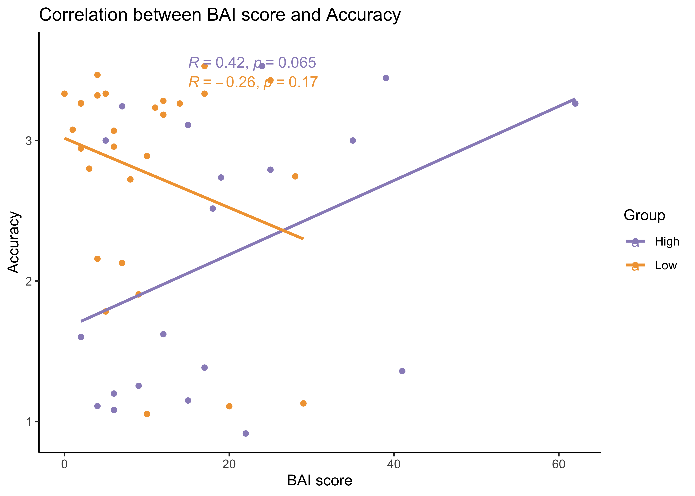
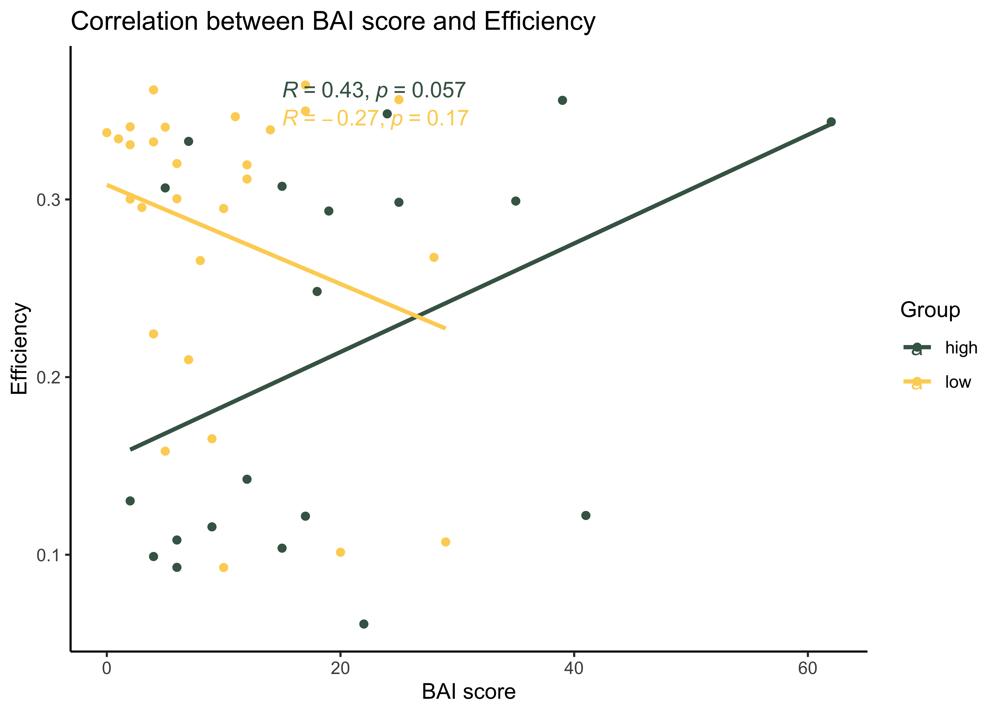
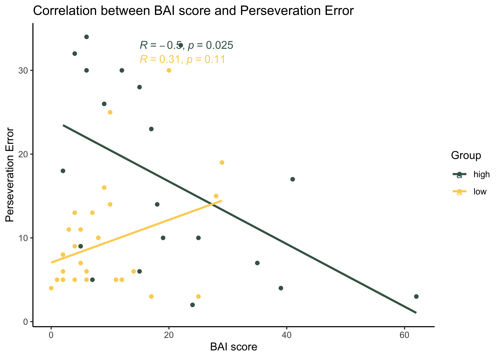
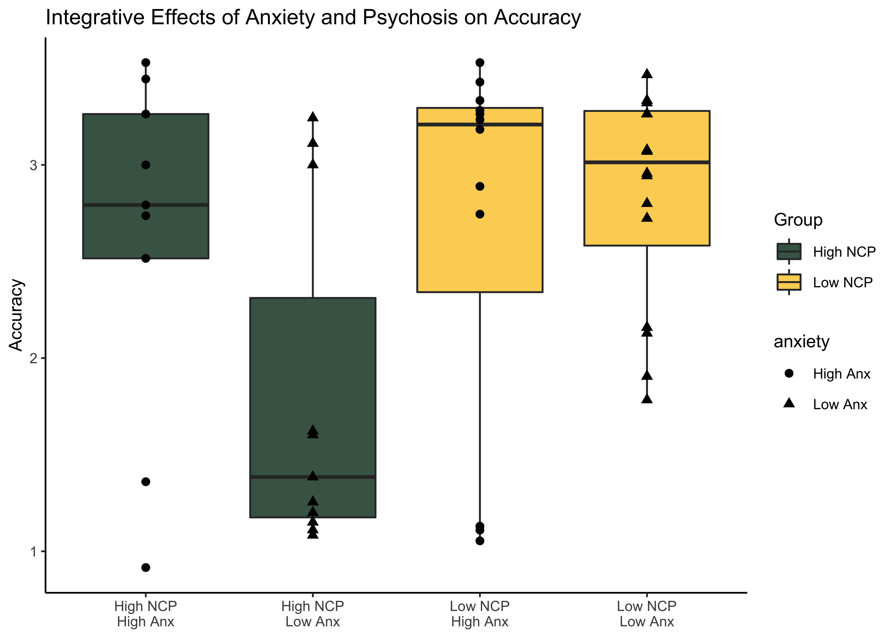
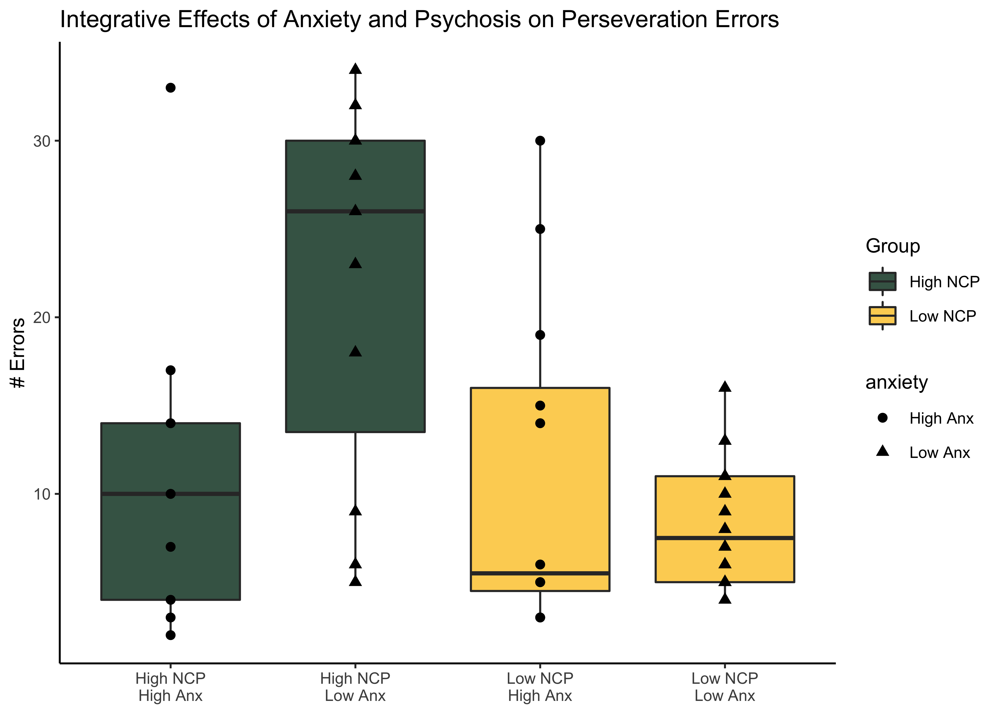
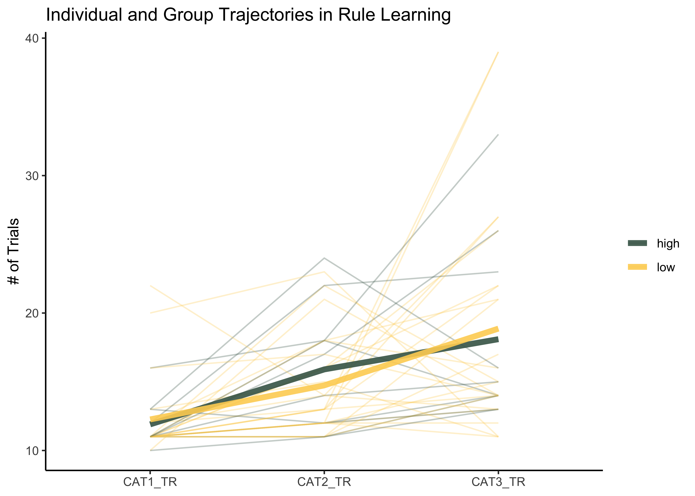
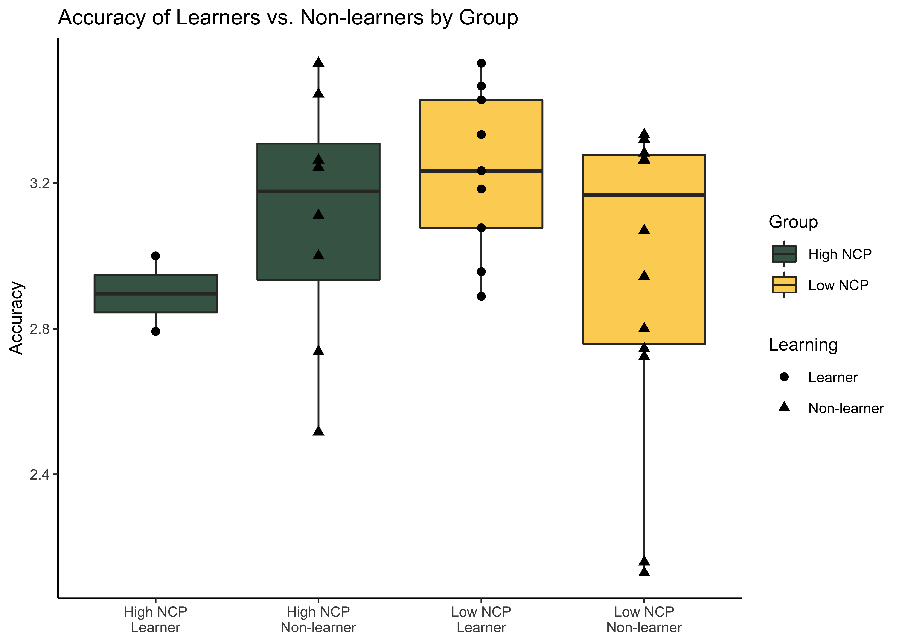

NCP\_Analysis\_Prelim
================
Jadyn Park
1/20/2021

**Research Questions:**  
**1.** Do implicit learning strategies differ between Low NCP and High
NCP?  
**2.** Are clinically relevant traits/symptoms (i.e., anxiety) related
to the difference in group performance?  
**3.** Do relevant traits contribute to perseveration errors in implicit
learning tasks?

**Research Aims:**  
**Aim 1.** To test group differences in cognitive performance between
Low vs. High NCP  
**Aim 2.** To test if group performance is related to anxious/impulsive
symptoms  
**Aim 3.** To test if anxiety is correlated with perseveration errors in
implicit learning tasks

**Hypotheses:**  
**1.** Low NCPs perform better than high NCPs  
**2.** Greater the BAI (anxiety) scores, worse the performance in
tasks  
**3.** Low NCPs perform better (i.e., perseverate less) than high NCPs
and anxious symptoms (potentially) moderate this relationship  
**3.1.** Alternatively, greater anxiety may only affect high NCP but not
low NCP

### This document displays preliminary results from NCP data.

``` r
#load libraries 
rm(list = ls())
library(knitr); library(kableExtra); library(reshape2); library(tidyverse); library(dplyr); library(effsize); library(tables); library(ggplot2); library(ggpubr); library(RColorBrewer); library(ez); source("~/Desktop/Anxiety NCP/summarySEwithin2.R"); library(wesanderson)

#import data - demographics, self report, and PCET
data <- read.csv("~/Desktop/Anxiety NCP/Anxiety_NCP_master.csv", header = TRUE)
```

### Demographics

``` r
# Demographics
demo <- data %>% group_by(Group) %>%
  dplyr::summarise(N = sum(!is.na(Subject.ID)),
            meanAge = round(mean(Age, na.rm = TRUE), 3),
            sdAge = round(sd(Age, na.rm = TRUE), 3),
            female = sum(Sex == "F"),
            male = sum(Sex == "M"),
            eastAsian = sum(Race == "east asian"),
            white = sum(Race == "white"),
            interracial = sum(Race == "interracial"),
            black = sum(Race == "black"),
  )

demo <- data.frame(t(demo)) # transpose
demo <- demo[2:10,]
colnames(demo) <- c("High NCP", "Low NCP") # column names
rownames(demo) <- c("N", "Mean", "SD", "Female", "Male", 
                           "East Asian", "White", "Interracial", "Black") # row names

knitr::kable(format(demo, digits = 3, drop0trailing = TRUE), caption = "Participant Demographics") %>%
  kable_styling(c("striped", full_width = F)) %>%
  pack_rows("Count", 1, 1) %>%
  pack_rows("Age", 2, 3) %>%
  pack_rows("Sex", 4, 5) %>%
  pack_rows("Race", 6, 9) 
```

<table class="table table-striped" style="margin-left: auto; margin-right: auto;">

<caption>

Participant Demographics

</caption>

<thead>

<tr>

<th style="text-align:left;">

</th>

<th style="text-align:left;">

High NCP

</th>

<th style="text-align:left;">

Low NCP

</th>

</tr>

</thead>

<tbody>

<tr grouplength="1">

<td colspan="3" style="border-bottom: 1px solid;">

<strong>Count</strong>

</td>

</tr>

<tr>

<td style="text-align:left; padding-left: 2em;" indentlevel="1">

N

</td>

<td style="text-align:left;">

29

</td>

<td style="text-align:left;">

37

</td>

</tr>

<tr grouplength="2">

<td colspan="3" style="border-bottom: 1px solid;">

<strong>Age</strong>

</td>

</tr>

<tr>

<td style="text-align:left; padding-left: 2em;" indentlevel="1">

Mean

</td>

<td style="text-align:left;">

20.786

</td>

<td style="text-align:left;">

20.056

</td>

</tr>

<tr>

<td style="text-align:left; padding-left: 2em;" indentlevel="1">

SD

</td>

<td style="text-align:left;">

1.95

</td>

<td style="text-align:left;">

1.97

</td>

</tr>

<tr grouplength="2">

<td colspan="3" style="border-bottom: 1px solid;">

<strong>Sex</strong>

</td>

</tr>

<tr>

<td style="text-align:left; padding-left: 2em;" indentlevel="1">

Female

</td>

<td style="text-align:left;">

22

</td>

<td style="text-align:left;">

26

</td>

</tr>

<tr>

<td style="text-align:left; padding-left: 2em;" indentlevel="1">

Male

</td>

<td style="text-align:left;">

6

</td>

<td style="text-align:left;">

10

</td>

</tr>

<tr grouplength="4">

<td colspan="3" style="border-bottom: 1px solid;">

<strong>Race</strong>

</td>

</tr>

<tr>

<td style="text-align:left; padding-left: 2em;" indentlevel="1">

East Asian

</td>

<td style="text-align:left;">

6

</td>

<td style="text-align:left;">

4

</td>

</tr>

<tr>

<td style="text-align:left; padding-left: 2em;" indentlevel="1">

White

</td>

<td style="text-align:left;">

7

</td>

<td style="text-align:left;">

22

</td>

</tr>

<tr>

<td style="text-align:left; padding-left: 2em;" indentlevel="1">

Interracial

</td>

<td style="text-align:left;">

3

</td>

<td style="text-align:left;">

3

</td>

</tr>

<tr>

<td style="text-align:left; padding-left: 2em;" indentlevel="1">

Black

</td>

<td style="text-align:left;">

6

</td>

<td style="text-align:left;">

2

</td>

</tr>

</tbody>

</table>

### Let’s talk about sex distribution baby

Conducting Chi-square test to test the independence between two
variables – (1) Group (high vs. low), (2) Sex (M vs. F)

``` r
# Chi-square to test whether group is independent from sex
test <- chisq.test(table(data$Group, data$Sex))
X_squared = test[["statistic"]]; df = test[["parameter"]]; p.value = test[["p.value"]]; method = test[["method"]]
test.frame <- data.frame(X_squared, df, p.value, method)
row.names(test.frame) <- NULL

knitr::kable(format(test.frame, digits = 5, drop0trailing = TRUE), 
             caption = "p-value > .05, Group (high vs. low) and Sex (M vs. F) are independent") %>% 
             kable_styling(c("striped", "bordered", full_width = F))
```

<table class="table table-striped table-bordered" style="margin-left: auto; margin-right: auto;">

<caption>

p-value \> .05, Group (high vs. low) and Sex (M vs. F) are independent

</caption>

<thead>

<tr>

<th style="text-align:left;">

X\_squared

</th>

<th style="text-align:left;">

df

</th>

<th style="text-align:left;">

p.value

</th>

<th style="text-align:left;">

method

</th>

</tr>

</thead>

<tbody>

<tr>

<td style="text-align:left;">

0.36906

</td>

<td style="text-align:left;">

2

</td>

<td style="text-align:left;">

0.8315

</td>

<td style="text-align:left;">

Pearson’s Chi-squared test

</td>

</tr>

</tbody>

</table>

``` r
# Chi-square to test whether Group is independent from sex
  # CAPE Positive Frequency scores are used to define NCP
  # 1st Q: 0-5, 2nd Q: 6-8, 3rd Q: 9-11, 4th Q: 12 and above
  # 9(Median) used as a cutoff for median split
  # Low NCP = 1st & 2nd Q, High NCP = 3rd & 4th
data$Quartile <- ifelse(data$Pos_Freq < 6, "1st",
                         ifelse(5<data$Pos_Freq & data$Pos_Freq<9, "2nd",
                          ifelse(8<data$Pos_Freq & data$Pos_Freq<12, "3rd",
                           ifelse(11<data$Pos_Freq, "4th", NA))))

data <- data[, c(1:5, 52, 6:51)] # reordering columns so that Quartile column is next to CAPE score

test2 <- chisq.test(table(data$Sex, data$Quartile))
X_squared = test2[["statistic"]]; df = test2[["parameter"]]; p.value = test2[["p.value"]]; method = test2[["method"]]
test2.frame <- data.frame(X_squared, df, p.value, method)
row.names(test2.frame) <- NULL

knitr::kable(format(test2.frame, digits = 5, drop0trailing = TRUE), 
             caption = "p-value > .05, Quartiles (1, 2, 3, 4)) and Sex (M vs. F) are independent") %>% 
             kable_styling(c("striped", "bordered", full_width = F))
```

<table class="table table-striped table-bordered" style="margin-left: auto; margin-right: auto;">

<caption>

p-value \> .05, Quartiles (1, 2, 3, 4)) and Sex (M vs. F) are
independent

</caption>

<thead>

<tr>

<th style="text-align:left;">

X\_squared

</th>

<th style="text-align:left;">

df

</th>

<th style="text-align:left;">

p.value

</th>

<th style="text-align:left;">

method

</th>

</tr>

</thead>

<tbody>

<tr>

<td style="text-align:left;">

2.9604

</td>

<td style="text-align:left;">

6

</td>

<td style="text-align:left;">

0.8138

</td>

<td style="text-align:left;">

Pearson’s Chi-squared test

</td>

</tr>

</tbody>

</table>

### Self Report Data

Preliminary data suggests CAPE positive frequency scores are positively
correlated with BAI scores

``` r
#Self Report data (CAPE positive & total, LSHS, BAI, BIS, BAS)
SR <- data %>% select(Subject.ID, Group, Pos_Freq, CAPE.sum, LSHS.sum, HPS.sum, BAI.sum, BIS.sum, BAS.fun, BAS.reward, BAS.drive, BAS.sum) 

# BAI-CAPE regression graph 
ggplot(SR, aes(x=Pos_Freq, y=BAI.sum, col = Group)) + 
 geom_point() +
  geom_smooth(method = lm , se = TRUE) +
   labs(title = "Correlation between CAPE score (Positive Frequency Only) and BAI score",
       x = "CAPE Positive Frequency score", y = "BAI score") +
  theme_classic() +
  stat_cor(method = "pearson", label.x = c(12, 3), label.y = c(30, 30)) +
  scale_color_manual(values = wes_palette(n=2, name = "Chevalier1"))
```

<!-- -->

``` r
# Linear Regression Summary 
low.NCP <- SR %>% filter(Group == "low")
summary(lm(low.NCP$BAI.sum~low.NCP$Pos_Freq)) # no significant relationship between BAI and CAPE
```

    ## 
    ## Call:
    ## lm(formula = low.NCP$BAI.sum ~ low.NCP$Pos_Freq)
    ## 
    ## Residuals:
    ##    Min     1Q Median     3Q    Max 
    ## -7.367 -5.866 -3.866  2.384 21.134 
    ## 
    ## Coefficients:
    ##                  Estimate Std. Error t value Pr(>|t|)  
    ## (Intercept)        7.2233     2.6946   2.681    0.012 *
    ## low.NCP$Pos_Freq   0.6429     0.5699   1.128    0.269  
    ## ---
    ## Signif. codes:  0 '***' 0.001 '**' 0.01 '*' 0.05 '.' 0.1 ' ' 1
    ## 
    ## Residual standard error: 8.159 on 29 degrees of freedom
    ##   (6 observations deleted due to missingness)
    ## Multiple R-squared:  0.04203,    Adjusted R-squared:  0.009002 
    ## F-statistic: 1.273 on 1 and 29 DF,  p-value: 0.2685

``` r
high.NCP <- SR %>% filter(Group == "high")
summary(lm(high.NCP$BAI.sum~high.NCP$Pos_Freq)) # no significant relationship between BAI and CAPE
```

    ## 
    ## Call:
    ## lm(formula = high.NCP$BAI.sum ~ high.NCP$Pos_Freq)
    ## 
    ## Residuals:
    ##     Min      1Q  Median      3Q     Max 
    ## -23.859 -10.335  -0.585   5.017  39.369 
    ## 
    ## Coefficients:
    ##                   Estimate Std. Error t value Pr(>|t|)
    ## (Intercept)         -1.327     14.241  -0.093    0.927
    ## high.NCP$Pos_Freq    1.409      1.023   1.377    0.182
    ## 
    ## Residual standard error: 14.24 on 22 degrees of freedom
    ##   (5 observations deleted due to missingness)
    ## Multiple R-squared:  0.07938,    Adjusted R-squared:  0.03753 
    ## F-statistic: 1.897 on 1 and 22 DF,  p-value: 0.1823

### PCET (Penn Conditional Exclusion Task) Performance

Participants are given 48 trials to learn which characteristic (size,
shape, or line thickness) is determining the “odd man out”. They must
get 10 consecutive correct answers. After those correct answers, the
characteristic is changed. The PCET is scored based on a composite of
total correct responses and the number of rules/principles the
participant learned. Specifically, a performance composite score is
calculated by multiplying the number of principles learned (plus 1 to
accommodate those who do not learn a single rule) by proportion of
correct responses (i.e., correct responses/total responses). (Moore et
al., 2019)

#### PCET Output Variables

PCET\_NUM = total number of responses (correct + incorrect)  
PCETCR = total number of correct responses PCETER = total number of
incorrect responses  
PCET\_CAT = number of categories achieved (shape, line thickness,
size)  
CAT(1, 2, 3)\_TR = correct + incorrect number of trials to achieve 1st,
2nd, 3rd category  
PER\_ER = measure of perseverative error PCET\_EFF = efficiency  
PCET\_ACC = accuracy ((correct trials/total trials)\*category achieved)

### Performance based on Accuracy, Efficiency, and Perseveration Error

``` r
pcet <- data %>% select(Subject.ID, Group, PCETER, PCETRTCR, PCETRTER, PCET_CAT, CAT1_TR, CAT2_TR, CAT3_TR, PCET_EFF, PER_ER, PCET_ACC)
high <- pcet %>% filter(Group == "high") #subset of high-NCP
low <- pcet %>% filter(Group == "low") #subset of low-NCP

# 1. Category Achieved
h.cat <- pcet %>% filter(Group == "high") %>% summarise(n = sum(Group=="high" & !is.na(PCET_CAT)),
                                                       mean = mean(PCET_CAT, na.rm = T),
                                                       sd = sd(PCET_CAT, na.rm = T)) 
l.cat <- pcet %>% filter(Group == "low") %>% summarise(n = sum(Group=="low" & !is.na(PCET_CAT)),
                                                       mean = mean(PCET_CAT, na.rm = T),
                                                       sd = sd(PCET_CAT, na.rm = T)) 

# Significance Test
#var.test(high$PCET_CAT, low$PCET_CAT) #P<.05, heterogeneous sample
cat.t <- t.test(high$PCET_CAT, low$PCET_CAT, var.equal=F)
cat.d <- cohen.d(high$PCET_CAT, low$PCET_CAT, na.rm=T)

# 2. Accuracy (PCET_ACC)
# N, mean, and SD of high-NCP
h.acc<- pcet %>% filter(Group == "high") %>% summarise(n = sum(Group=="high" & !is.na(PCET_CAT)),
                                                       mean = mean(PCET_ACC, na.rm = T),
                                                       sd = sd(PCET_ACC, na.rm = T)) 

# N, mean, and SD of low-NCP
l.acc <- pcet %>% filter(Group == "low") %>% summarise(n = sum(Group=="low" & !is.na(PCET_CAT)),
                                                           mean = mean(PCET_ACC, na.rm = T),
                                                           sd = sd(PCET_ACC, na.rm = T)) 
  
# Box Plot of Accuracy by Group
ggplot(pcet, aes(x=Group, y=PCET_ACC, fill = Group), na.rm = TRUE) +
  geom_boxplot(position = position_dodge()) +
  geom_dotplot(binaxis='y', stackdir='center', dotsize=.5, position = position_dodge()) +
  theme_classic() +
  scale_fill_manual(values = wes_palette(n=3, name = "Chevalier1")) +
  labs(title = "Accuracy by Group", y = "Accuracy")
```

<!-- -->

``` r
# Significance Test of Accuracy by Group
#var.test(high$PCET_ACC, low$PCET_ACC) #Fisher's F-test, p>0.05; homogeneous sample
acc.t <- t.test(high$PCET_ACC, low$PCET_ACC, var.equal = TRUE) #p<.05
acc.d <- cohen.d(high$PCET_ACC, low$PCET_ACC, na.rm = T)

# 3. Efficiency (PCET_EFF)
# N, mean, and SD of high-NCP
h.eff <- pcet %>% filter(Group == "high") %>% summarise(n = sum(Group=="high" & !is.na(PCET_CAT)),
                                                        mean = mean(PCET_EFF, na.rm = T),
                                                        sd = sd(PCET_EFF, na.rm = T)) 
# N, mean, and SD of low-NCP
l.eff <- pcet %>% filter(Group == "low") %>% summarise(n = sum(Group=="low" & !is.na(PCET_CAT)),
                                                           mean = mean(PCET_EFF, na.rm = T),
                                                           sd = sd(PCET_EFF, na.rm = T)) 

# Box Plot of Efficiency by Group 
ggplot(pcet, aes(x=Group, y=PCET_EFF, fill = Group), na.rm = TRUE) +
  geom_boxplot(position = position_dodge()) +
  geom_dotplot(binaxis='y', stackdir='center', dotsize=.5, position = position_dodge()) +
  theme_classic() +
  scale_fill_manual(values = wes_palette(n=3, name = "Chevalier1")) +
  labs(title = "Efficiency by Group", y = "Efficiency")
```

<!-- -->

``` r
# Significance Test of Efficiency by Group 
#var.test(high$PCET_EFF, low$PCET_EFF) #Fisher's F-test, p>0.05; homogeneous sample
eff.t <- t.test(high$PCET_EFF, low$PCET_EFF, var.equal = TRUE) 
eff.d <- cohen.d(high$PCET_EFF, low$PCET_EFF, na.rm = T)

# 4. Perseveration Error Rate (PER_ER)
# N, mean, and SD of high-NCP
h.err <- pcet %>% filter(Group == "high") %>% summarise(n = sum(Group=="high" & !is.na(PCET_CAT)),
                                                            mean = mean(PER_ER, na.rm = T),
                                                            sd = sd(PER_ER, na.rm = T))
# N, mean, and SD of low-NCP
l.err <- pcet %>% filter(Group == "low") %>% summarise(n = sum(Group=="low" & !is.na(PCET_CAT)),
                                                           mean = mean(PER_ER, na.rm = T),
                                                           sd = sd(PER_ER, na.rm = T)) 

# Box Plot of Perseveration Error by Group
ggplot(pcet, aes(x=Group, y=PER_ER, fill = Group), na.rm = TRUE) +
  geom_boxplot(position = position_dodge()) +
  geom_dotplot(binaxis='y', stackdir='center', dotsize=.5, position = position_dodge()) +
  theme_classic() +
  scale_fill_manual(values = wes_palette(n=3, name = "Chevalier1")) +
  labs(title = "Perseveration Errors by Group", y = "# Error Trials")
```

<!-- -->

``` r
# Significance Test of Perseveration Error by Group
#var.test(as.numeric(score.high$value), as.numeric(score.low$value)) #homogeneous
error.t <- t.test(high$PER_ER, low$PER_ER, var.equal=T) #p=0.014
error.d <- cohen.d(high$PER_ER, low$PER_ER, na.rm = T)

# Summary Table
h.cat = paste(round(h.cat['mean'], 2), "(", round(h.cat['sd'], 2), ")", sep = "")
l.cat = paste(round(l.cat['mean'], 2), "(", round(l.cat['sd'], 2), ")", sep = "")
h.acc.sum = paste(round(h.acc['mean'], 2), "(" , round(h.acc['sd'], 2), ")", sep = "")
h.eff.sum = paste(round(h.eff['mean'], 2), "(" , round(h.eff['sd'], 2), ")", sep = "")
h.err.sum = paste(round(h.err['mean'], 2), "(" , round(h.err['sd'], 2), ")", sep = "")
l.acc.sum = paste(round(l.acc['mean'], 2), "(" , round(l.acc['sd'], 2), ")", sep = "")
l.eff.sum = paste(round(l.eff['mean'], 2), "(" , round(l.eff['sd'], 2), ")", sep = "")
l.err.sum = paste(round(l.err['mean'], 2), "(" , round(l.err['sd'], 2), ")", sep = "")

high.summary <- cbind(h.cat, h.acc.sum, h.eff.sum, h.err.sum)
pval <- round(cbind(cat.t[["p.value"]], acc.t[["p.value"]], eff.t[["p.value"]], error.t[["p.value"]]),3)
low.summary <- cbind(l.cat, l.acc.sum, l.eff.sum, l.err.sum)
cohensd <- abs(round(cbind(cat.d[["estimate"]], acc.d[["estimate"]], eff.d[["estimate"]], error.d[["estimate"]]), 3))
performance.table <- data.frame(rbind(high.summary, low.summary, pval, cohensd))
colnames(performance.table) <- c("CAT", "Accuracy", "Efficiency", "Perseveration")
rownames(performance.table) <- c("High NCP", "Low NCP", "p-value", "Cohen's D")

knitr::kable(performance.table,caption = "Category Achieved, Accuracy, Efficiency, and Perseveration Summary") %>%
  kable_styling(c("striped", "bordered", full_width = F)) 
```

<table class="table table-striped table-bordered" style="margin-left: auto; margin-right: auto;">

<caption>

Category Achieved, Accuracy, Efficiency, and Perseveration Summary

</caption>

<thead>

<tr>

<th style="text-align:left;">

</th>

<th style="text-align:left;">

CAT

</th>

<th style="text-align:left;">

Accuracy

</th>

<th style="text-align:left;">

Efficiency

</th>

<th style="text-align:left;">

Perseveration

</th>

</tr>

</thead>

<tbody>

<tr>

<td style="text-align:left;">

High NCP

</td>

<td style="text-align:left;">

2.5(0.59)

</td>

<td style="text-align:left;">

1.58(0.75)

</td>

<td style="text-align:left;">

0.21(0.1)

</td>

<td style="text-align:left;">

15.33(9.63)

</td>

</tr>

<tr>

<td style="text-align:left;">

Low NCP

</td>

<td style="text-align:left;">

2.82(0.39)

</td>

<td style="text-align:left;">

2.04(0.61)

</td>

<td style="text-align:left;">

0.28(0.08)

</td>

<td style="text-align:left;">

9.09(6.49)

</td>

</tr>

<tr>

<td style="text-align:left;">

p-value

</td>

<td style="text-align:left;">

0.027

</td>

<td style="text-align:left;">

0.013

</td>

<td style="text-align:left;">

0.012

</td>

<td style="text-align:left;">

0.005

</td>

</tr>

<tr>

<td style="text-align:left;">

Cohen’s D

</td>

<td style="text-align:left;">

0.657

</td>

<td style="text-align:left;">

0.686

</td>

<td style="text-align:left;">

0.694

</td>

<td style="text-align:left;">

0.785

</td>

</tr>

</tbody>

</table>

### PCET & Clinical Traits

``` r
# Group x Accuracy Correlation 
ggplot(data, aes(x = Pos_Freq, y = PCET_ACC, col = Group)) + geom_point() +
  geom_smooth(method = lm , se = F) +
  scale_color_manual(values = wes_palette(n=2, name = "Chevalier1")) +
  labs(title = "Correlation between CAPE positive score and Accuracy by Group",
       x = "CAPE Positive Score", y = "Accuracy") +
  theme_classic() +
  stat_cor(label.x = 15)
```

<!-- -->

``` r
# Group x Efficiency Correlation 
ggplot(data, aes(x = Pos_Freq, y = PCET_EFF, col = Group)) + geom_point() +
  geom_smooth(method = lm , se = F) +
  scale_color_manual(values = wes_palette(n=2, name = "Chevalier1")) +
  labs(title = "Correlation between CAPE positive score and Efficiency by Group",
       x = "CAPE Positive Score", y = "Efficiency") +
  theme_classic() +
  stat_cor(label.x = 15)
```

<!-- -->

``` r
# Group x Perseveration Error Correlation 
ggplot(data, aes(x = Pos_Freq, y = PER_ER, col = Group)) + geom_point() +
  geom_smooth(method = lm , se = F) +
  scale_color_manual(values = wes_palette(n=2, name = "Chevalier1")) +
  labs(title = "Correlation between CAPE positive score and Perseveration Error by Group",
       x = "CAPE Positive Score", y = "Perseveration Error") +
  theme_classic() +
  stat_cor(label.x = 15)
```

<!-- -->

``` r
# Anxiety x Accuracy Correlation by Group
ggplot(data, aes(x = BAI.sum, y = PCET_ACC, col = Group), na.rm = T) + geom_point() +
  geom_smooth(method = lm , se = F) +
  scale_color_manual(values = wes_palette(n=2, name = "Chevalier1")) +
  labs(title = "Correlation between BAI score and Accuracy", x = "BAI score", y = "Accuracy") +
  theme_classic() +
  stat_cor(label.x = 15)
```

<!-- -->

``` r
# Does Group x Anxiety Interaction predict Accuracy?
  # X = Anxiety Score, # D = Group (1 = high NCP, 0 = low NCP) # Y = Accuracy
  # Yi = B0 + B1Xi + B2Xi + ui
interac <- data %>% select(PCET_ACC, BAI.sum, Group)
summary(lm(data = interac, PCET_ACC ~ BAI.sum*Group))
```

    ## 
    ## Call:
    ## lm(formula = PCET_ACC ~ BAI.sum * Group, data = interac)
    ## 
    ## Residuals:
    ##     Min      1Q  Median      3Q     Max 
    ## -1.3532 -0.5146  0.1394  0.4117  1.1244 
    ## 
    ## Coefficients:
    ##                   Estimate Std. Error t value Pr(>|t|)    
    ## (Intercept)       1.160477   0.237542   4.885 1.41e-05 ***
    ## BAI.sum           0.021077   0.009791   2.153 0.036876 *  
    ## Grouplow          1.091842   0.307615   3.549 0.000933 ***
    ## BAI.sum:Grouplow -0.040723   0.018383  -2.215 0.031963 *  
    ## ---
    ## Signif. codes:  0 '***' 0.001 '**' 0.01 '*' 0.05 '.' 0.1 ' ' 1
    ## 
    ## Residual standard error: 0.6522 on 44 degrees of freedom
    ##   (18 observations deleted due to missingness)
    ## Multiple R-squared:  0.228,  Adjusted R-squared:  0.1754 
    ## F-statistic: 4.331 on 3 and 44 DF,  p-value: 0.009261

``` r
# Anxiety x Efficiency Correlation by Group
ggplot(data, aes(x = BAI.sum, y = PCET_EFF, col = Group), na.rm = T) + geom_point() +
  geom_smooth(method = lm , se = F) +
  scale_color_manual(values = wes_palette(n=2, name = "Chevalier1")) +
  labs(title = "Correlation between BAI score and Efficiency", x = "BAI score", y = "Efficiency") +
  theme_classic() +
  stat_cor(label.x = 15)
```

<!-- -->

``` r
# Does Group x Anxiety Interaction predict Efficiency?
interac1 <- data %>% select(PCET_EFF, BAI.sum, Group)
summary(lm(data = interac1, PCET_EFF ~ BAI.sum*Group))
```

    ## 
    ## Call:
    ## lm(formula = PCET_EFF ~ BAI.sum * Group, data = interac1)
    ## 
    ## Residuals:
    ##      Min       1Q   Median       3Q      Max 
    ## -0.18753 -0.06787  0.02841  0.06573  0.15829 
    ## 
    ## Coefficients:
    ##                   Estimate Std. Error t value Pr(>|t|)    
    ## (Intercept)       0.153017   0.032776   4.669 2.86e-05 ***
    ## BAI.sum           0.003056   0.001351   2.262 0.028699 *  
    ## Grouplow          0.155203   0.042444   3.657 0.000679 ***
    ## BAI.sum:Grouplow -0.005845   0.002536  -2.304 0.025978 *  
    ## ---
    ## Signif. codes:  0 '***' 0.001 '**' 0.01 '*' 0.05 '.' 0.1 ' ' 1
    ## 
    ## Residual standard error: 0.08999 on 44 degrees of freedom
    ##   (18 observations deleted due to missingness)
    ## Multiple R-squared:  0.2382, Adjusted R-squared:  0.1863 
    ## F-statistic: 4.587 on 3 and 44 DF,  p-value: 0.007031

``` r
# Anxiety x Perseveration Errors Correlation by Group 
ggplot(data, aes(x = BAI.sum, y = PER_ER, col = Group), na.rm = T) + geom_point() +
  geom_smooth(method = lm , se = F) +
  scale_color_manual(values = wes_palette(n=2, name = "Chevalier1")) +
  labs(title = "Correlation between BAI score and Perseveration Error", x = "BAI score", y = "Perseveration Error") +
  theme_classic() +
  stat_cor(label.x = 15)
```

<!-- -->

``` r
# Does Group x Anxiety Interaction predict Perseveration ERror?
interac2 <- data %>% select(PER_ER, BAI.sum, Group)
summary(lm(data = interac2, PER_ER ~ BAI.sum*Group))
```

    ## 
    ## Call:
    ## lm(formula = PER_ER ~ BAI.sum * Group, data = interac2)
    ## 
    ## Residuals:
    ##     Min      1Q  Median      3Q     Max 
    ## -14.471  -4.222  -1.752   4.986  16.266 
    ## 
    ## Coefficients:
    ##                  Estimate Std. Error t value Pr(>|t|)    
    ## (Intercept)       21.7880     2.6823   8.123 2.69e-10 ***
    ## BAI.sum           -0.3310     0.1106  -2.993  0.00451 ** 
    ## Grouplow         -15.1343     3.4735  -4.357 7.79e-05 ***
    ## BAI.sum:Grouplow   0.5350     0.2076   2.577  0.01339 *  
    ## ---
    ## Signif. codes:  0 '***' 0.001 '**' 0.01 '*' 0.05 '.' 0.1 ' ' 1
    ## 
    ## Residual standard error: 7.364 on 44 degrees of freedom
    ##   (18 observations deleted due to missingness)
    ## Multiple R-squared:  0.3155, Adjusted R-squared:  0.2688 
    ## F-statistic: 6.759 on 3 and 44 DF,  p-value: 0.0007557

### PCET & Clinical Traits on Box Plot

``` r
# Mean Anxiety Scores for Each Group
anx.means <- data %>% select(Group, BAI.sum) %>%
  dplyr::group_by(Group) %>%
  dplyr::summarise(mean.anx = mean(BAI.sum, na.rm = T), sd.anx = sd(BAI.sum, na.rm = T))

# BAI score by Group (above or below average)
anx.data <- data %>% select(Subject.ID, Group, BAI.sum)

anx.data$anxiety <- ifelse(anx.data$Group == "high" & anx.data$BAI.sum > 17.88, "above",
 ifelse(anx.data$Group == "low" & anx.data$BAI.sum > 9.77, "above",
  ifelse(anx.data$Group == "high" & anx.data$BAI.sum < 17.88, "below", "below"))) # 'above' or 'below' mean anxiety score of each group, mean value is hard-coded

pcet <- merge(pcet, anx.data, by = "Subject.ID")
colnames(pcet)[which(names(pcet) == "Group.x")] <- "Group"

##### 1. Accuracy #####
pcet %>%
  filter(!is.na(anxiety)) %>%
  mutate(Group = ifelse(Group == "high", "High NCP", "Low NCP"),
         anxiety = ifelse(anxiety == "above", "High Anx", "Low Anx"),
         Interaction = factor(str_replace(interaction(Group, anxiety),
                                          '\\.', '\n'),
                              ordered=TRUE)) %>%
  ggplot(aes(x=Interaction, y=PCET_ACC)) +
  geom_boxplot(aes(fill=Group)) +
  geom_point(aes(shape=anxiety), size = 2) +
  scale_fill_manual(values = wes_palette(n=3, name = "Chevalier1")) +
  labs(title="Integrative Effects of Anxiety and Psychosis on Accuracy", y="Accuracy") +
  theme_classic(base_size=10) +
  theme(axis.title.x=element_blank())
```

<!-- -->

``` r
##### 3. Efficiency #####
pcet %>%
  filter(!is.na(anxiety)) %>%
  mutate(Group = ifelse(Group == "high", "High NCP", "Low NCP"),
         anxiety = ifelse(anxiety == "above", "High Anx", "Low Anx"),
         Interaction = factor(str_replace(interaction(Group, anxiety),
                                          '\\.', '\n'),
                              ordered=TRUE)) %>%
  ggplot(aes(x=Interaction, y=PCET_EFF)) +
  geom_boxplot(aes(fill=Group)) +
  geom_point(aes(shape=anxiety), size = 2) +
  scale_fill_manual(values = wes_palette(n=3, name = "Chevalier1")) +
  labs(title="Integrative Effects of Anxiety and Psychosis on Efficiency", y="Efficiency") +
  theme_classic(base_size=10) +
  theme(axis.title.x=element_blank())
```

<!-- -->

``` r
##### 4. Perseveration Error #####
pcet %>%
  filter(!is.na(anxiety)) %>%
  mutate(Group = ifelse(Group == "high", "High NCP", "Low NCP"),
         anxiety = ifelse(anxiety == "above", "High Anx", "Low Anx"),
         Interaction = factor(str_replace(interaction(Group, anxiety),
                                          '\\.', '\n'),
                              ordered=TRUE)) %>%
  ggplot(aes(x=Interaction, y=PER_ER)) +
  geom_boxplot(aes(fill=Group)) +
  geom_point(aes(shape=anxiety), size = 2) +
  scale_fill_manual(values = wes_palette(n=3, name = "Chevalier1")) +
  labs(title="Integrative Effects of Anxiety and Psychosis on Perseveration Errors", y="# Errors") +
  theme_classic(base_size=10) +
  theme(axis.title.x=element_blank())
```

<!-- -->
\#\#\# PCET Performance by Block

``` r
pcet <- pcet %>% filter(PCET_CAT == 3) # excluding incomplete subjects (ie category achieved <3)
pcet.trials <- melt(pcet, id.vars = c("Group", "Subject.ID"), variable_name = "metric") # individual trials data
blocks <- c("CAT1_TR", "CAT2_TR", "CAT3_TR")
pcet.trials <- pcet.trials %>% filter(variable %in% blocks) # filter out irrelevant variables
pcet.trials$value <- as.numeric(pcet.trials$value, na.rm = T)
pcet.trials$Subject.ID <- as.factor(pcet.trials$Subject.ID) 

pcet.blocks <- pcet.trials %>% dplyr::group_by(Group, variable) %>%
  dplyr::summarise(value = mean(value, na.rm = T)) # group means data
```

#### Number of trials to achieve category as a proxy for rule learning. Individuals must choose the correct object on 10 consecutive trials to “achieve category”. Once it is achieved, new rule is in effect

``` r
# Individual and Group Trajectory
ggplot(pcet.trials, aes(x = variable, y = value, color = Group)) +
  geom_line(aes(group = Subject.ID), alpha = .3) +
  geom_line(data = pcet.blocks, aes(group = Group), alpha = .9, size = 2) +
  theme_classic() +
  scale_color_manual(values = wes_palette(n=2, name="Chevalier1")) +
  labs(
    title = "Individual and Group Trajectories in Rule Learning",
    x = NULL,
    y = "# of Trials",
    color = NULL
  )
```

<!-- -->
\#\#\# High- vs. Low- Performers Comparing the performance in Block 2
and Block 3. If \# trials in Block 3 \> Block 2 = low performer (slow
learner); Block 3 =\< Block 2 = high performer (fast learner). Then,
comparing anxiety scores by performers.

``` r
pcet$learn <- ifelse(pcet$CAT3_TR-pcet$CAT2_TR > 0, "non", "learn")

# 1. Accuracy: learner vs. non-learners 
pcet %>%
  mutate(Group = ifelse(Group == "high", "High NCP", "Low NCP"),
         Learning = ifelse(learn == "learn", "Learner", "Non-learner"),
         Interaction = factor(str_replace(interaction(Group, Learning),
                                          '\\.', '\n'),
                              ordered=TRUE)) %>%
  ggplot(aes(x=Interaction, y=PCET_ACC)) +
  geom_boxplot(aes(fill=Group)) +
  geom_point(aes(shape=Learning), size = 2) +
  scale_fill_manual(values = wes_palette(n=3, name = "Chevalier1")) +
  labs(title="Accuracy of Learners vs. Non-learners by Group", y="Accuracy") +
  theme_classic(base_size=10) +
  theme(axis.title.x=element_blank())
```

<!-- -->

``` r
# 2. Efficiency: learner vs. non-learner
pcet %>%
  mutate(Group = ifelse(Group == "high", "High NCP", "Low NCP"),
         Learning = ifelse(learn == "learn", "Learner", "Non-learner"),
         Interaction = factor(str_replace(interaction(Group, Learning),
                                          '\\.', '\n'),
                              ordered=TRUE)) %>%
  ggplot(aes(x=Interaction, y=PCET_EFF)) +
  geom_boxplot(aes(fill=Group)) +
  geom_point(aes(shape=Learning), size = 2) +
  scale_fill_manual(values = wes_palette(n=3, name = "Chevalier1")) +
  labs(title="Efficiency of Learners vs. Non-learners by Group", y="Efficiency") +
  theme_classic(base_size=10) +
  theme(axis.title.x=element_blank())
```

<!-- -->

``` r
# 3. Perseveration Error: learner vs. non-learner
pcet %>%
  mutate(Group = ifelse(Group == "high", "High NCP", "Low NCP"),
         Learning = ifelse(learn == "learn", "Learner", "Non-learner"),
         Interaction = factor(str_replace(interaction(Group, Learning),
                                          '\\.', '\n'),
                              ordered=TRUE)) %>%
  ggplot(aes(x=Interaction, y=PER_ER)) +
  geom_boxplot(aes(fill=Group)) +
  geom_point(aes(shape=Learning), size = 2) +
  scale_fill_manual(values = wes_palette(n=3, name = "Chevalier1")) +
  labs(title="Perseveration Error of Learners vs. Non-learners by Group", y="Perseveration Errors") +
  theme_classic(base_size=10) +
  theme(axis.title.x=element_blank())
```

<!-- -->
