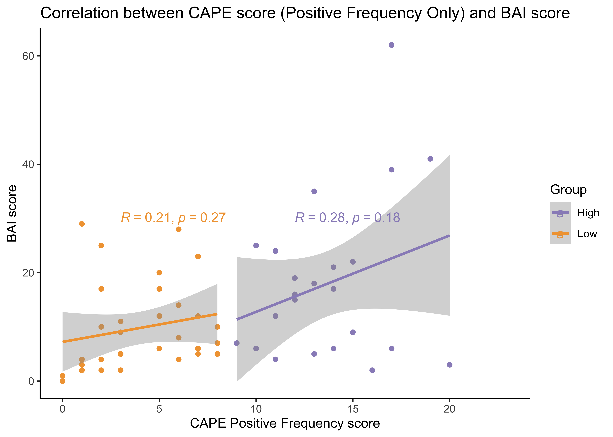
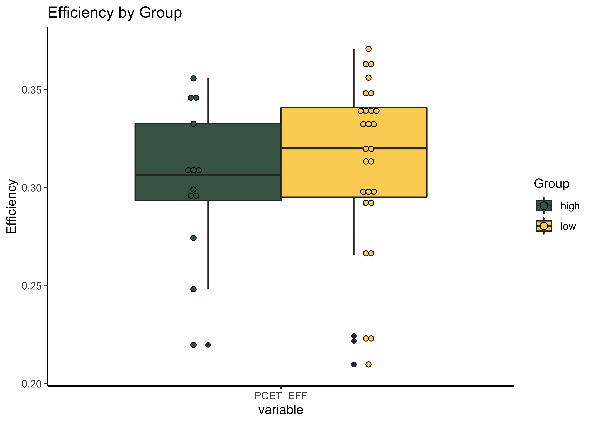
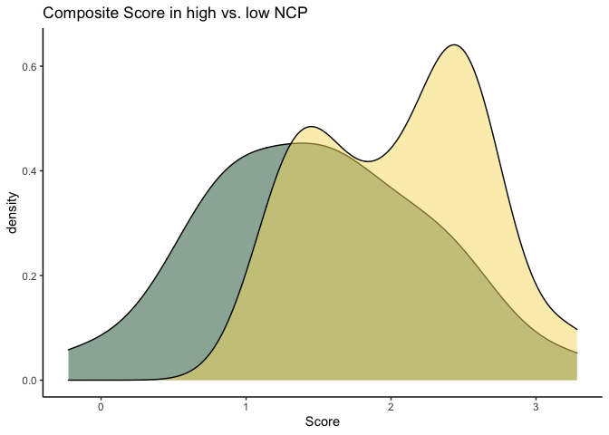
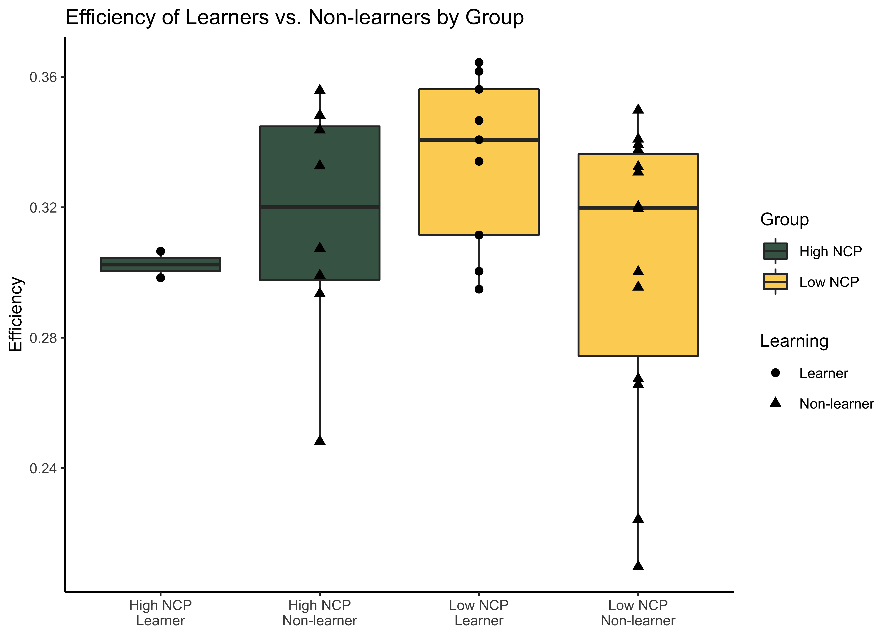
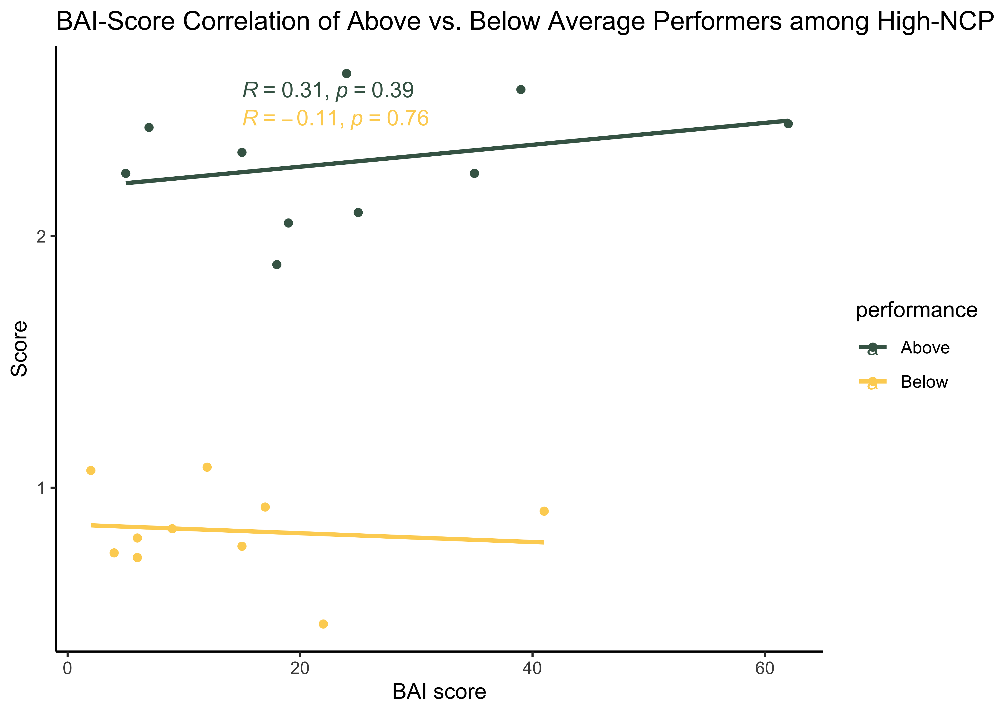
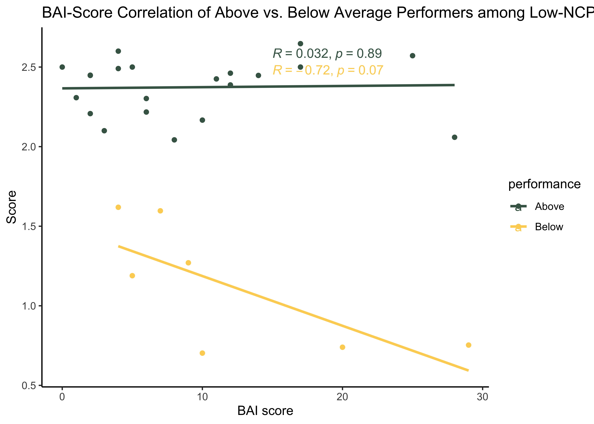
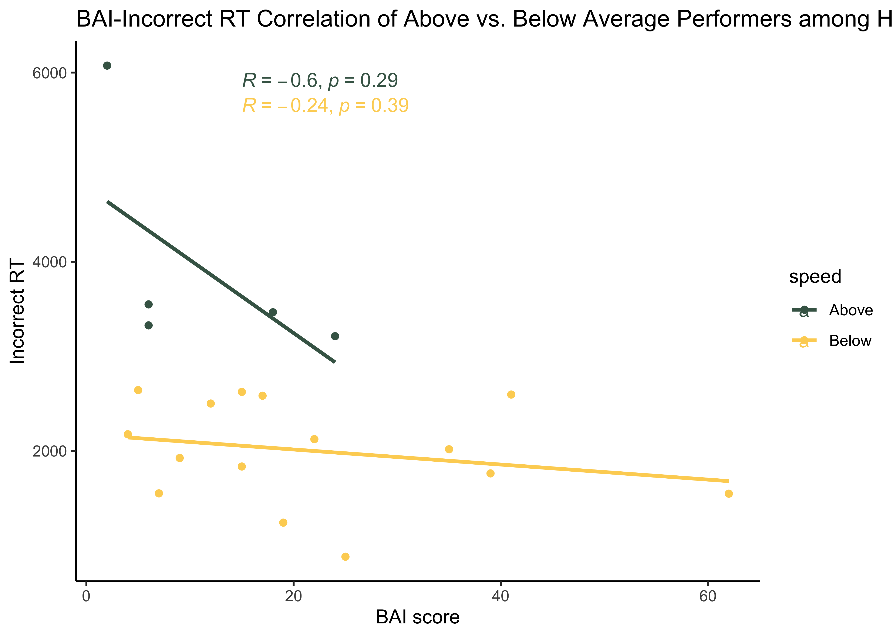

NCP\_Analysis\_Prelim
================
Jadyn Park
1/20/2021

**Research Questions:**  
**1.** Do implicit learning strategies differ between Low NCP and High
NCP?  
**2.** Are clinically relevant traits/symptoms (i.e.,
anxiety/impulsivity) related to the difference in group performance?  
**3.** Do relevant traits contribute to perseveration errors in implicit
learning tasks?

**Research Aims:**  
**Aim 1.** To test group differences in cognitive performance between
Low vs. High NCP  
**Aim 2.** To test if group performance is related to anxious/impulsive
symptoms  
**Aim 3.** To test if anxiety/impulsivity is correlated with
perseveration errors in implicit learning tasks

**Hypotheses:**  
**1.** Low NCPs perform better than high NCPs  
**2.** Greater the BAI (anxiety) & BAS (impulsivity) scores, worse the
performance in tasks  
**3.** Low NCPs perform better (i.e., perseverate less) than high NCPs
and anxious symptoms (potentially) moderate this relationship  
**3.1.** Alternatively, greater anxiety/impulsivity may only affect high
NCP but not low NCP

### This document displays EXTREMELY preliminary results from NCP data.

``` r
#load libraries 
rm(list = ls())
library(knitr); library(kableExtra); library(reshape2); library(tidyverse); library(dplyr); library(effsize); library(tables); library(ggplot2); library(ggpubr); library(RColorBrewer); library(ez); source("~/Desktop/Anxiety NCP/summarySEwithin2.R"); library(wesanderson)

#import data - demographics, self report, and PCET
data <- read.csv("~/Desktop/Anxiety NCP/Anxiety_NCP_master.csv", header = TRUE)
```

### Demographics

``` r
# Demographics
demo.data <- data %>% dplyr::summarise(N = sum(!is.na(Subject.ID)),
            meanAge = mean(Age, na.rm = TRUE),
            female = sum(Sex == "F"),
            male = sum(Sex == "M"),
            eastAsian = sum(Race == "east asian"),
            white = sum(Race == "white"),
            interracial = sum(Race == "interracial"),
            black = sum(Race == "black"),
            high = sum(Group == "high"),
            low = sum(Group == "low"))

t_demo.data <- as.data.frame(t(demo.data))
names(t_demo.data) <- c("count or M")
rownames(t_demo.data) <- c("N", "Mean Age", "Female", "Male", 
                           "East Asian", "White", "Interracial", "Black", "High NCP", "Low NCP")

knitr::kable(format(t_demo.data, digits = 5, drop0trailing = TRUE), caption = "Participant Demographics") %>%
  kable_styling(c("striped", full_width = F)) %>%
  pack_rows("Sex", 3, 4) %>%
  pack_rows("Race", 5, 8) %>%
  pack_rows("NCP group", 9, 10)
```

<table class="table table-striped" style="margin-left: auto; margin-right: auto;">

<caption>

Participant Demographics

</caption>

<thead>

<tr>

<th style="text-align:left;">

</th>

<th style="text-align:left;">

count or M

</th>

</tr>

</thead>

<tbody>

<tr>

<td style="text-align:left;">

N

</td>

<td style="text-align:left;">

66

</td>

</tr>

<tr>

<td style="text-align:left;">

Mean Age

</td>

<td style="text-align:left;">

20.375

</td>

</tr>

<tr grouplength="2">

<td colspan="2" style="border-bottom: 1px solid;">

<strong>Sex</strong>

</td>

</tr>

<tr>

<td style="text-align:left; padding-left: 2em;" indentlevel="1">

Female

</td>

<td style="text-align:left;">

48

</td>

</tr>

<tr>

<td style="text-align:left; padding-left: 2em;" indentlevel="1">

Male

</td>

<td style="text-align:left;">

16

</td>

</tr>

<tr grouplength="4">

<td colspan="2" style="border-bottom: 1px solid;">

<strong>Race</strong>

</td>

</tr>

<tr>

<td style="text-align:left; padding-left: 2em;" indentlevel="1">

East Asian

</td>

<td style="text-align:left;">

10

</td>

</tr>

<tr>

<td style="text-align:left; padding-left: 2em;" indentlevel="1">

White

</td>

<td style="text-align:left;">

29

</td>

</tr>

<tr>

<td style="text-align:left; padding-left: 2em;" indentlevel="1">

Interracial

</td>

<td style="text-align:left;">

6

</td>

</tr>

<tr>

<td style="text-align:left; padding-left: 2em;" indentlevel="1">

Black

</td>

<td style="text-align:left;">

8

</td>

</tr>

<tr grouplength="2">

<td colspan="2" style="border-bottom: 1px solid;">

<strong>NCP group</strong>

</td>

</tr>

<tr>

<td style="text-align:left; padding-left: 2em;" indentlevel="1">

High NCP

</td>

<td style="text-align:left;">

29

</td>

</tr>

<tr>

<td style="text-align:left; padding-left: 2em;" indentlevel="1">

Low NCP

</td>

<td style="text-align:left;">

37

</td>

</tr>

</tbody>

</table>

### Let’s talk about sex distribution baby

Conducting Chi-square test to test the independence between two
variables – (1) Group (high vs. low), (2) Sex (M vs. F)

``` r
# Chi-square to test whether group is independent from sex
test <- chisq.test(table(data$Group, data$Sex))
X_squared = test[["statistic"]]; df = test[["parameter"]]; p.value = test[["p.value"]]; method = test[["method"]]
test.frame <- data.frame(X_squared, df, p.value, method)
row.names(test.frame) <- NULL

knitr::kable(format(test.frame, digits = 5, drop0trailing = TRUE), 
             caption = "p-value > .05, Group (high vs. low) and Sex (M vs. F) are independent") %>% 
             kable_styling(c("striped", "bordered", full_width = F))
```

<table class="table table-striped table-bordered" style="margin-left: auto; margin-right: auto;">

<caption>

p-value \> .05, Group (high vs. low) and Sex (M vs. F) are independent

</caption>

<thead>

<tr>

<th style="text-align:left;">

X\_squared

</th>

<th style="text-align:left;">

df

</th>

<th style="text-align:left;">

p.value

</th>

<th style="text-align:left;">

method

</th>

</tr>

</thead>

<tbody>

<tr>

<td style="text-align:left;">

0.36906

</td>

<td style="text-align:left;">

2

</td>

<td style="text-align:left;">

0.8315

</td>

<td style="text-align:left;">

Pearson’s Chi-squared test

</td>

</tr>

</tbody>

</table>

``` r
# Chi-square to test whether Group is independent from sex
  # CAPE Positive Frequency scores are used to define NCP
  # 1st Q: 0-5, 2nd Q: 6-8, 3rd Q: 9-11, 4th Q: 12 and above
  # 9(Median) used as a cutoff for median split
  # Low NCP = 1st & 2nd Q, High NCP = 3rd & 4th
data$Quartile <- ifelse(data$Pos_Freq < 6, "1st",
                         ifelse(5<data$Pos_Freq & data$Pos_Freq<9, "2nd",
                          ifelse(8<data$Pos_Freq & data$Pos_Freq<12, "3rd",
                           ifelse(11<data$Pos_Freq, "4th", NA))))

data <- data[, c(1:5, 52, 6:51)] # reordering columns so that Quartile column is next to CAPE score

test2 <- chisq.test(table(data$Sex, data$Quartile))
X_squared = test2[["statistic"]]; df = test2[["parameter"]]; p.value = test2[["p.value"]]; method = test2[["method"]]
test2.frame <- data.frame(X_squared, df, p.value, method)
row.names(test2.frame) <- NULL

knitr::kable(format(test2.frame, digits = 5, drop0trailing = TRUE), 
             caption = "p-value > .05, Quartiles (1, 2, 3, 4)) and Sex (M vs. F) are independent") %>% 
             kable_styling(c("striped", "bordered", full_width = F))
```

<table class="table table-striped table-bordered" style="margin-left: auto; margin-right: auto;">

<caption>

p-value \> .05, Quartiles (1, 2, 3, 4)) and Sex (M vs. F) are
independent

</caption>

<thead>

<tr>

<th style="text-align:left;">

X\_squared

</th>

<th style="text-align:left;">

df

</th>

<th style="text-align:left;">

p.value

</th>

<th style="text-align:left;">

method

</th>

</tr>

</thead>

<tbody>

<tr>

<td style="text-align:left;">

2.9604

</td>

<td style="text-align:left;">

6

</td>

<td style="text-align:left;">

0.8138

</td>

<td style="text-align:left;">

Pearson’s Chi-squared test

</td>

</tr>

</tbody>

</table>

### Self Report Data

Preliminary data suggests CAPE positive frequency scores are positively
correlated with BAI scores

``` r
#Self Report data (CAPE positive & total, LSHS, BAI, BIS, BAS)
SR <- data %>% select(Subject.ID, Group, Pos_Freq, CAPE.sum, LSHS.sum, HPS.sum, BAI.sum, BIS.sum, BAS.fun, BAS.reward, BAS.drive, BAS.sum) 

# BAI-CAPE regression graph 
ggplot(SR, aes(x=Pos_Freq, y=BAI.sum, col = Group)) + 
 geom_point() +
  geom_smooth(method = lm , se = TRUE) +
   labs(title = "Correlation between CAPE score (Positive Frequency Only) and BAI score",
       x = "CAPE Positive Frequency score", y = "BAI score") +
  theme_classic() +
  stat_cor(method = "pearson", label.x = c(12, 3), label.y = c(30, 30)) +
  scale_color_manual(values = wes_palette(n=2, name = "Chevalier1"))
```

<!-- -->

``` r
# Linear Regression Summary 
low.NCP <- SR %>% filter(Group == "low")
summary(lm(low.NCP$BAI.sum~low.NCP$Pos_Freq)) # no significant relationship between BAI and CAPE
```

    ## 
    ## Call:
    ## lm(formula = low.NCP$BAI.sum ~ low.NCP$Pos_Freq)
    ## 
    ## Residuals:
    ##    Min     1Q Median     3Q    Max 
    ## -7.367 -5.866 -3.866  2.384 21.134 
    ## 
    ## Coefficients:
    ##                  Estimate Std. Error t value Pr(>|t|)  
    ## (Intercept)        7.2233     2.6946   2.681    0.012 *
    ## low.NCP$Pos_Freq   0.6429     0.5699   1.128    0.269  
    ## ---
    ## Signif. codes:  0 '***' 0.001 '**' 0.01 '*' 0.05 '.' 0.1 ' ' 1
    ## 
    ## Residual standard error: 8.159 on 29 degrees of freedom
    ##   (6 observations deleted due to missingness)
    ## Multiple R-squared:  0.04203,    Adjusted R-squared:  0.009002 
    ## F-statistic: 1.273 on 1 and 29 DF,  p-value: 0.2685

``` r
high.NCP <- SR %>% filter(Group == "high")
summary(lm(high.NCP$BAI.sum~high.NCP$Pos_Freq)) # no significant relationship between BAI and CAPE
```

    ## 
    ## Call:
    ## lm(formula = high.NCP$BAI.sum ~ high.NCP$Pos_Freq)
    ## 
    ## Residuals:
    ##     Min      1Q  Median      3Q     Max 
    ## -23.859 -10.335  -0.585   5.017  39.369 
    ## 
    ## Coefficients:
    ##                   Estimate Std. Error t value Pr(>|t|)
    ## (Intercept)         -1.327     14.241  -0.093    0.927
    ## high.NCP$Pos_Freq    1.409      1.023   1.377    0.182
    ## 
    ## Residual standard error: 14.24 on 22 degrees of freedom
    ##   (5 observations deleted due to missingness)
    ## Multiple R-squared:  0.07938,    Adjusted R-squared:  0.03753 
    ## F-statistic: 1.897 on 1 and 22 DF,  p-value: 0.1823

### PCET (Penn Conditional Exclusion Task) Performance

Participants are given 48 trials to learn which characteristic (size,
shape, or line thickness) is determining the “odd man out”. They must
get 10 consecutive correct answers. After those correct answers, the
characteristic is changed. The PCET is scored based on a composite of
total correct responses and the number of rules/principles the
participant learned. Specifically, a performance composite score is
calculated by multiplying the number of principles learned (plus 1 to
accommodate those who do not learn a single rule) by proportion of
correct responses (i.e., correct responses/total responses). (Moore et
al., 2019)


``` r
pcet <- data %>% select(Subject.ID, Group, PCET_NUM, PCETCR, PCETER, PCETRTCR, PCETRTER, PCET_CAT, CAT1_TR, CAT2_TR, CAT3_TR, PCET_EFF)

# PCET_NUM = total number of responses (correct + incorrect)
# PCETCR = total number of correct responses 
  # keep in mind that the rule changes only when the participant has answered correctly on 10 consecutive trials
  # if a participant makes a mistake, their CR will exceed 30
# PCETER = total number of incorrect responses
# PCET_CAT = number of categories (i.e., rules) achieved
  # if participant never got the rule, CAT = 0
# CAT1_TR = total number of trials (correct + incorrect) took to achieve 1st category
  # this will always include 10 consecutive successful trials
# CAT2_TR = same as CAT1 but for the 2nd category
# CAT3_TR = same as above but for the last category
  # if participant never got the rule, default is to complete 48 trials

pcet.melt <- melt(pcet, id.vars = c("Group", "Subject.ID"), variable_name="metric") #as a list
pcet.melt$value <- as.numeric(pcet.melt$value, na.rm = T) #value as numeric

pcet.fx <- function(data, varname, groupnames){
  require(plyr)
  summary_func <- function(x, col){
    c(mean = mean(x[[col]], na.rm=TRUE),
      sd = sd(x[[col]], na.rm=TRUE))
  }
  data_sum<-ddply(data, groupnames, .fun=summary_func,
                  varname)
  data_sum <- rename(data_sum, c("mean" = varname))
 return(data_sum)
} #function for SummaryWithin2 package -- calculates mean and sd

pcet.summary <- pcet.fx(pcet.melt, varname="value", groupnames=c("Group", "variable")) #summarized by quartile & variable (total, correct, incorrect)

# 1. Number of Correct, Incorrect, and Total Trials in High vs. Low NCP
trials <- c("PCET_NUM", "PCETCR", "PCETER")
pcet.group1 <- pcet.summary %>% filter(variable %in% trials)
pcet.group1$variable <- c("PCET_NUM" = "Total", "PCETCR" = "Correct", "PCETER" = "Incorrect")

# Graph of Correct, Incorrect, Total Trials By Group 
ggplot(pcet.group1, aes(x = variable, y = value, fill = variable)) +
  geom_bar(position = "dodge", stat = "identity") + 
  geom_errorbar(aes(ymin = value-sd, ymax = value+sd), width = .2,
                    position = position_dodge(.9)) +
  facet_grid(.~Group) +
  scale_fill_manual(values = wes_palette(n=3, name = "Chevalier1")) +
  ggtitle("Mean # Correct and Incorrect Trials in High vs. Low NCP") + 
  xlab("Mean Total, Correct, and Incorrect Responses") +
  ylab("# Trials") +
  labs(fill = "Responses (Total, Correct, Incorrect)") +
  theme(
    panel.background = element_rect(fill = "transparent"), 
    plot.background = element_rect(fill = "transparent", color = NA),
    axis.line.x = element_line(color = "black", size = 0.4),
    axis.line.y = element_line(color = "black", size = 0.4)
  )
```

<!-- -->

``` r
# 1.1 Significance Test
##Total Responses
total.high <- subset(pcet.melt, Group == "high" & variable == "PCET_NUM")
total.low <- subset(pcet.melt, Group == "low" & variable == "PCET_NUM")
#var.test(total.high$value, total.low$value) ##Fisher's F-test, p<0.05; heterogeneous sample
t.test(total.high$value, total.low$value, var.equal = FALSE) #two-sample t test, p = 0.0117; significant difference in total number of responses between high vs. low NCP
```

    ## 
    ##  Welch Two Sample t-test
    ## 
    ## data:  total.high$value and total.low$value
    ## t = 2.6518, df = 37.18, p-value = 0.0117
    ## alternative hypothesis: true difference in means is not equal to 0
    ## 95 percent confidence interval:
    ##   3.004263 22.450282
    ## sample estimates:
    ## mean of x mean of y 
    ##  63.66667  50.93939

``` r
############# Effect Size #############
high.m = pcet.group1[1,3]
high.n = sum(pcet.melt$Group=="high" & pcet.melt$variable=="PCET_NUM")
high.sd =  pcet.group1[1,4]
low.m = pcet.group1[4,3]
low.sd = pcet.group1[4,4]
low.n = sum(pcet.melt$Group=="low" & pcet.melt$variable=="PCET_NUM")

mean.diff = high.m - low.m
sd.pooled = sqrt(((high.n-1)*high.sd^2+(low.n-1)*low.sd^2)/(high.n+low.n-2))
cohensD = mean.diff/sd.pooled
############# Cohen's D = 0.7498 #############


##Correct Responses
correct.high <- subset(pcet.melt, Group == "high" & variable == "PCETCR")
correct.low <- subset(pcet.melt, Group == "low" & variable == "PCETCR")
#var.test(correct.high$value, correct.low$value) #Fisher's F-test, p>0.05; both samples are homogeneous
t.test(correct.high$value, correct.low$value, var.equal = TRUE) #two-sample t-test, p = 0.4882; no significant difference in total number of correct responses between low vs. high NCP
```

    ## 
    ##  Two Sample t-test
    ## 
    ## data:  correct.high$value and correct.low$value
    ## t = 0.69787, df = 55, p-value = 0.4882
    ## alternative hypothesis: true difference in means is not equal to 0
    ## 95 percent confidence interval:
    ##  -2.041791  4.223610
    ## sample estimates:
    ## mean of x mean of y 
    ##  35.33333  34.24242

``` r
###Incorrect Responses
incorr.high <- subset(pcet.melt, Group == "high" & variable == "PCETER")
incorr.low <- subset(pcet.melt, Group == "low" & variable == "PCETER")
#var.test(incorr.high$value, incorr.low$value) #Fisher's F-test, p>0.05; both samples are homogeneous
t.test(incorr.high$value, incorr.low$value, var.equal = TRUE) #two-sample t-test, p = 0.0069; significant difference in total number of incorrect responses between low vs. high NCP
```

    ## 
    ##  Two Sample t-test
    ## 
    ## data:  incorr.high$value and incorr.low$value
    ## t = 2.8049, df = 55, p-value = 0.006943
    ## alternative hypothesis: true difference in means is not equal to 0
    ## 95 percent confidence interval:
    ##   3.322521 19.950207
    ## sample estimates:
    ## mean of x mean of y 
    ##  28.33333  16.69697

``` r
############# Effect Size #############
high.m = pcet.group1[3,3]
high.n = sum(pcet.melt$Group=="high" & pcet.melt$variable=="PCETER")
high.sd =  pcet.group1[3,4]
low.m = pcet.group1[6,3]
low.sd = pcet.group1[6,4]
low.n = sum(pcet.melt$Group=="low" & pcet.melt$variable=="PCETER")

mean.diff = high.m-low.m
sd.pooled = sqrt(((high.n-1)*high.sd^2+(low.n-1)*low.sd^2)/(high.n+low.n-2))
cohensD = mean.diff/sd.pooled
############# Cohen's D = 0.7466 #############


# 2. RT of Correct and Incorrect Trials in High vs. Low NCP
reac <- c("PCETRTCR", "PCETRTER")
pcet.group2 <- pcet.summary %>% filter(variable %in% reac)
pcet.group2$variable <- c("PCETRTCR" = "RT Correct", "PCETRTER" = "RT Incorrect")

# Graph of Correct and Incorrect Trials by Group
ggplot(pcet.group2, aes(x = variable, y = value, fill = variable)) +
  geom_bar(position = "dodge", stat = "identity") +
  geom_errorbar(aes(ymin = value-sd, ymax = value+sd), width = .2,
                    position = position_dodge(.9)) +
  facet_grid(.~Group) +
  scale_fill_manual(values = wes_palette(n=3, name = "Chevalier1")) +
  ggtitle("RT of Correct and Incorrect Trials in High vs. Low NCP") + 
  xlab("Mean Correct, and Incorrect Responses") +
  ylab("RT (in ms)") +
  labs(fill = "Responses (Correct, Incorrect)") +
  theme(
    panel.background = element_rect(fill = "transparent"), 
    plot.background = element_rect(fill = "transparent", color = NA),
    axis.line.x = element_line(color = "black", size = 0.4),
    axis.line.y = element_line(color = "black", size = 0.4)
  )
```

<!-- -->

``` r
# 2.1 Significance Test
##Correct Responses
correct.high.rt <- subset(pcet.melt, Group == "high" & variable == "PCETRTCR")
correct.low.rt <- subset(pcet.melt, Group == "low" & variable == "PCETRTCR")
#var.test(correct.high.rt$value, correct.low.rt$value) #Fisher's F-test, p<0.05; heterogeneous sample
t.test(correct.high.rt$value, correct.low.rt$value, var.equal = FALSE) #Welch t-statistic, p = 0.1104; no significant difference in RT of correct responses between low vs. high NCP 
```

    ## 
    ##  Welch Two Sample t-test
    ## 
    ## data:  correct.high.rt$value and correct.low.rt$value
    ## t = 1.6436, df = 30.855, p-value = 0.1104
    ## alternative hypothesis: true difference in means is not equal to 0
    ## 95 percent confidence interval:
    ##  -62.23829 578.47314
    ## sample estimates:
    ## mean of x mean of y 
    ##  1834.708  1576.591

``` r
##Incorrect Responses
incorr.high.rt <- subset(pcet.melt, Group == "high" & variable == "PCETRTER")
incorr.low.rt <- subset(pcet.melt, Group == "low" & variable == "PCETRTER")
#var.test(incorr.high.rt$value, incorr.low.rt$value) #Fisher's F-test, p<0.05; heterogeneous sample
t.test(incorr.high.rt$value, incorr.low.rt$value, var.equal = FALSE) #Welch t-statistic, p = 0.0557; no significant difference in RT of incorrect responses between low vs. high NCP 
```

    ## 
    ##  Welch Two Sample t-test
    ## 
    ## data:  incorr.high.rt$value and incorr.low.rt$value
    ## t = 1.9803, df = 34.337, p-value = 0.05573
    ## alternative hypothesis: true difference in means is not equal to 0
    ## 95 percent confidence interval:
    ##   -15.01516 1176.15910
    ## sample estimates:
    ## mean of x mean of y 
    ##  2680.542  2099.970

``` r
############# Effect Size #############
high.m = pcet.group2[2,3]
high.n = sum(pcet.melt$Group=="high" & pcet.melt$variable=="PCETRTER")
high.sd =  pcet.group2[2,4]
low.m = pcet.group2[4,3]
low.sd = pcet.group2[4,4]
low.n = sum(pcet.melt$Group=="low" & pcet.melt$variable=="PCETRTER")

mean.diff = high.m-low.m
sd.pooled = sqrt(((high.n-1)*high.sd^2+(low.n-1)*low.sd^2)/(high.n+low.n-2))
cohensD = mean.diff/sd.pooled
############# Cohen's D = 0.5671 #############
```

### Performance based on Accuracy, Efficiency, and Composite Score

``` r
# 1. Accuracy (% Correct)
pcet <- pcet %>% mutate(freq = PCETCR/PCET_NUM)
pcet.freq <- melt(pcet, id.vars = c("Group", "Subject.ID"), variable_name="metric")
pcet.freq <- pcet.freq %>% filter(variable == "freq")

# N, mean, and SD of high-NCP
h.acc<- pcet.freq %>% filter(Group == "high") %>% summarise(n = sum(variable=="freq"),
                                                            mean = mean(as.numeric(value), na.rm = T),
                                                            sd = sd(as.numeric(value), na.rm = T)) 

# N, mean, and SD of low-NCP
l.acc <- pcet.freq %>% filter(Group == "low") %>% summarise(n = sum(variable=="freq"),
                                                           mean = mean(as.numeric(value), na.rm = T),
                                                           sd = sd(as.numeric(value), na.rm = T)) 

high.freq <- data.frame(hf = rnorm(h.acc$n, h.acc$mean, h.acc$sd)) # normalized
low.freq <- data.frame(lf = rnorm(l.acc$n, l.acc$mean, l.acc$sd))

# Density Plot of Accuracy by Group
ggplot() +
  geom_density(data = high.freq, aes(x = hf), 
               fill = "#145A32", color = "black", alpha = .5) + 
  geom_density(data = low.freq, aes(x = lf), 
               fill = "#F7DC6F", color = "black", alpha = .5) + 
  theme_classic() +
  ggtitle("Accuracy (% Correct) in high vs. low NCP") +
  xlab("Accuracy (% Correct)") 
```

<!-- -->

``` r
# Box Plot of Accuracy by Group
ggplot(pcet.freq, aes(x=variable, y=as.numeric(value), fill = Group), na.rm = TRUE) +
  geom_boxplot(position = position_dodge()) +
  geom_dotplot(binaxis='y', stackdir='center', dotsize=.5, position = position_dodge()) +
  theme_classic() +
  scale_fill_manual(values = wes_palette(n=3, name = "Chevalier1")) +
  labs(title = "Accuracy by Group", y = "Accuracy")
```

<!-- -->

``` r
# Significance Test of Accuracy by Group
freq.high <- subset(pcet.freq, Group == "high")
freq.low <- subset(pcet.freq, Group == "low")
#var.test(as.numeric(freq.high$value), as.numeric(freq.low$value)) #Fisher's F-test, p>0.05; homogeneous sample
t.test(as.numeric(freq.high$value), as.numeric(freq.low$value, var.equal = TRUE)) # p = 0.020
```

    ## 
    ##  Welch Two Sample t-test
    ## 
    ## data:  as.numeric(freq.high$value) and as.numeric(freq.low$value, var.equal = TRUE)
    ## t = -2.4117, df = 46.505, p-value = 0.01988
    ## alternative hypothesis: true difference in means is not equal to 0
    ## 95 percent confidence interval:
    ##  -0.1987507 -0.0179414
    ## sample estimates:
    ## mean of x mean of y 
    ## 0.5999165 0.7082625

``` r
# 2. Efficiency
pcet.eff <- pcet.melt %>% filter(variable=="PCET_EFF")

# N, mean, and SD of high-NCP
h.eff <- pcet.eff %>% filter(Group == "high") %>% summarise(n = sum(variable=="PCET_EFF"),
                                                            mean = mean(as.numeric(value), na.rm = T),
                                                            sd = sd(as.numeric(value), na.rm = T)) 
# N, mean, and SD of low-NCP
l.eff <- pcet.eff %>% filter(Group == "low") %>% summarise(n = sum(variable=="PCET_EFF"),
                                                           mean = mean(as.numeric(value), na.rm = T),
                                                           sd = sd(as.numeric(value), na.rm = T)) 

high.eff <- data.frame(he = rnorm(h.eff$n, h.eff$mean, h.eff$sd)) # normalized
low.eff <- data.frame(le = rnorm(l.eff$n, l.eff$mean, l.eff$sd))

# Density Plot of Efficiency By Group
ggplot() +
  geom_density(data = high.eff, aes(x = he),
               fill = "#145A32", color = "black", alpha = .5) +
  geom_density(data = low.eff, aes(x = le),
               fill = "#F7DC6F", color = "black", alpha = .5) +
  theme_classic() +
  ggtitle("Efficiency in high vs. low NCP") +
  xlab("Efficiency") 
```

<!-- -->

``` r
# Box Plot of Efficiency by Group 
ggplot(pcet.eff, aes(x=variable, y=as.numeric(value), fill = Group), na.rm = TRUE) +
  geom_boxplot(position = position_dodge()) +
  geom_dotplot(binaxis='y', stackdir='center', dotsize=.5, position = position_dodge()) +
  theme_classic() +
  scale_fill_manual(values = wes_palette(n=3, name = "Chevalier1")) +
  labs(title = "Efficiency by Group", y = "Efficiency")
```

<!-- -->

``` r
# Significance Test of Efficiency by Group 
eff.high <- subset(pcet.eff, Group == "high")
eff.low <- subset(pcet.eff, Group == "low")
#var.test(eff.high$value, eff.low$value) #Fisher's F-test, p>0.05; homogeneous sample
t.test(eff.high$value, eff.low$value, var.equal = TRUE) #p=0.0123
```

    ## 
    ##  Two Sample t-test
    ## 
    ## data:  eff.high$value and eff.low$value
    ## t = -2.5859, df = 55, p-value = 0.01239
    ## alternative hypothesis: true difference in means is not equal to 0
    ## 95 percent confidence interval:
    ##  -0.11453122 -0.01451954
    ## sample estimates:
    ## mean of x mean of y 
    ## 0.2139292 0.2784545

``` r
# 3. Composite score
pcet <- pcet %>% mutate(score = PCET_CAT * freq)
pcet.score <- melt(pcet, id.vars = c("Group", "Subject.ID"), variable_name="metric") 
pcet.score <- pcet.score %>% filter(variable == "score") 

# N, mean, and SD of high-NCP
h.sc <- pcet.score %>% filter(Group == "high") %>% summarise(n = sum(variable=="score"),
                                                            mean = mean(as.numeric(value), na.rm = T),
                                                            sd = sd(as.numeric(value), na.rm = T))

# N, mean, and SD of low-NCP
l.sc <- pcet.score %>% filter(Group == "low") %>% summarise(n = sum(variable=="score"),
                                                           mean = mean(as.numeric(value), na.rm = T),
                                                           sd = sd(as.numeric(value), na.rm = T)) 

high.score <- data.frame(hs = rnorm(h.sc$n, h.sc$mean, h.sc$sd)) # normalized
low.score <- data.frame(ls = rnorm(l.sc$n, l.sc$mean, l.sc$sd))

# Density Plot of Composite Score by Group
ggplot() +
  geom_density(data = high.score, aes(x = hs),
               fill = "#145A32", color = "black", alpha = .5) +
  geom_density(data = low.score, aes(x = ls),
               fill = "#F7DC6F", color = "black", alpha = .5) +
  theme_classic() +
  ggtitle("Composite Score in high vs. low NCP") +
  xlab("Score") 
```

<!-- -->

``` r
# Box Plot of Composite Score by Group
ggplot(pcet.score, aes(x=variable, y=as.numeric(value), fill = Group), na.rm = TRUE) +
  geom_boxplot(position = position_dodge()) +
  geom_dotplot(binaxis='y', stackdir='center', dotsize=.5, position = position_dodge()) +
  theme_classic() +
  scale_fill_manual(values = wes_palette(n=3, name = "Chevalier1")) +
  labs(title = "Composite Score by Group", y = "Score")
```

<!-- -->

``` r
# Significance Test of Composite Score by Group
score.high <- subset(pcet.score, Group == "high")
score.low <- subset(pcet.score, Group == "low")
#var.test(as.numeric(score.high$value), as.numeric(score.low$value)) #homogeneous
t.test(as.numeric(score.high$value), as.numeric(score.low$value), var.equal=T) #p=0.014
```

    ## 
    ##  Two Sample t-test
    ## 
    ## data:  as.numeric(score.high$value) and as.numeric(score.low$value)
    ## t = -2.5588, df = 55, p-value = 0.01328
    ## alternative hypothesis: true difference in means is not equal to 0
    ## 95 percent confidence interval:
    ##  -0.82013849 -0.09971838
    ## sample estimates:
    ## mean of x mean of y 
    ##  1.581096  2.041024

### PCET Performance by Block

``` r
pcet.melt <- pcet.melt %>% select(Group, variable, value)
blocks <- c("CAT1_TR", "CAT2_TR", "CAT3_TR")
pcet.block <- pcet.melt %>% filter(variable %in% blocks) %>%
  dplyr::group_by(Group, variable) %>%
  dplyr::summarise(Trials = mean(value, na.rm = T))

#Number of Trials by Block
ggplot(pcet.block, aes(x = variable, y = Trials, group = Group)) +
  geom_line(aes(linetype = Group, color = Group)) +
  geom_point() +
  scale_color_manual(values = wes_palette(n=3, name = "Chevalier1")) +
  theme_classic()
```

<!-- -->

### PCET & Clinical Traits

``` r
data <- data %>% mutate(freq = as.numeric(PCETCR/PCET_NUM), score = as.numeric(PCET_CAT * freq))

# Group x Accuracy Correlation 
ggplot(data, aes(x = Pos_Freq, y = freq, col = Group)) + geom_point() +
  geom_smooth(method = lm , se = F) +
  scale_color_manual(values = wes_palette(n=2, name = "Chevalier1")) +
  labs(title = "Correlation between CAPE positive score and Accuracy by Group",
       x = "CAPE Positive Score", y = "Accuracy") +
  theme_classic() +
  stat_cor(label.x = 15)
```

<!-- -->

``` r
# Group x Efficiency Correlation 
ggplot(data, aes(x = Pos_Freq, y = PCET_EFF, col = Group)) + geom_point() +
  geom_smooth(method = lm , se = F) +
  scale_color_manual(values = wes_palette(n=2, name = "Chevalier1")) +
  labs(title = "Correlation between CAPE positive score and Efficiency by Group",
       x = "CAPE Positive Score", y = "Efficiency") +
  theme_classic() +
  stat_cor(label.x = 15)
```

<!-- -->

``` r
# Group x Composite Score Correlation 
ggplot(data, aes(x = Pos_Freq, y = score, col = Group)) + geom_point() +
  geom_smooth(method = lm , se = F) +
  scale_color_manual(values = wes_palette(n=2, name = "Chevalier1")) +
  labs(title = "Correlation between CAPE positive score and Composite Score by Group",
       x = "CAPE Positive Score", y = "PCET Score") +
  theme_classic() +
  stat_cor(label.x = 15)
```

<!-- -->

``` r
# Anxiety x Accuracy Correlation by Group
ggplot(data, aes(x = BAI.sum, y = freq, col = Group), na.rm = T) + geom_point() +
  geom_smooth(method = lm , se = F) +
  scale_color_manual(values = wes_palette(n=2, name = "Chevalier1")) +
  labs(title = "Correlation between BAI score and Accuracy", x = "BAI score", y = "Accuracy") +
  theme_classic() +
  stat_cor(label.x = 15)
```

<!-- -->

``` r
# Does Group x Anxiety Interaction predict Accuracy?
  # X = Anxiety Score, # D = Group (1 = high NCP, 0 = low NCP) # Y = Accuracy
  # Yi = B0 + B1Xi + B2Xi + ui

summary(lm(data = data, freq ~ BAI.sum*Group))
```

    ## 
    ## Call:
    ## lm(formula = freq ~ BAI.sum * Group, data = data)
    ## 
    ## Residuals:
    ##      Min       1Q   Median       3Q      Max 
    ## -0.36202 -0.13048  0.02811  0.09604  0.27318 
    ## 
    ## Coefficients:
    ##                   Estimate Std. Error t value Pr(>|t|)    
    ## (Intercept)       0.500528   0.057719   8.672 4.47e-11 ***
    ## BAI.sum           0.005300   0.002379   2.228   0.0311 *  
    ## Grouplow          0.263472   0.074746   3.525   0.0010 ** 
    ## BAI.sum:Grouplow -0.010363   0.004467  -2.320   0.0250 *  
    ## ---
    ## Signif. codes:  0 '***' 0.001 '**' 0.01 '*' 0.05 '.' 0.1 ' ' 1
    ## 
    ## Residual standard error: 0.1585 on 44 degrees of freedom
    ##   (18 observations deleted due to missingness)
    ## Multiple R-squared:  0.2233, Adjusted R-squared:  0.1703 
    ## F-statistic: 4.216 on 3 and 44 DF,  p-value: 0.0105

``` r
# Anxiety x Efficiency Correlation by Group
ggplot(data, aes(x = BAI.sum, y = PCET_EFF, col = Group), na.rm = T) + geom_point() +
  geom_smooth(method = lm , se = F) +
  scale_color_manual(values = wes_palette(n=2, name = "Chevalier1")) +
  labs(title = "Correlation between BAI score and Efficiency", x = "BAI score", y = "Efficiency") +
  theme_classic() +
  stat_cor(label.x = 15)
```

<!-- -->

``` r
# Does Group x Anxiety Interaction predict Efficiency?
summary(lm(data = data, PCET_EFF ~ BAI.sum*Group))
```

    ## 
    ## Call:
    ## lm(formula = PCET_EFF ~ BAI.sum * Group, data = data)
    ## 
    ## Residuals:
    ##      Min       1Q   Median       3Q      Max 
    ## -0.18753 -0.06787  0.02841  0.06573  0.15829 
    ## 
    ## Coefficients:
    ##                   Estimate Std. Error t value Pr(>|t|)    
    ## (Intercept)       0.153017   0.032776   4.669 2.86e-05 ***
    ## BAI.sum           0.003056   0.001351   2.262 0.028699 *  
    ## Grouplow          0.155203   0.042444   3.657 0.000679 ***
    ## BAI.sum:Grouplow -0.005845   0.002536  -2.304 0.025978 *  
    ## ---
    ## Signif. codes:  0 '***' 0.001 '**' 0.01 '*' 0.05 '.' 0.1 ' ' 1
    ## 
    ## Residual standard error: 0.08999 on 44 degrees of freedom
    ##   (18 observations deleted due to missingness)
    ## Multiple R-squared:  0.2382, Adjusted R-squared:  0.1863 
    ## F-statistic: 4.587 on 3 and 44 DF,  p-value: 0.007031

``` r
# Anxiey x Score Correlation by Group 
ggplot(data, aes(x = BAI.sum, y = score, col = Group), na.rm = T) + geom_point() +
  geom_smooth(method = lm , se = F) +
  scale_color_manual(values = wes_palette(n=2, name = "Chevalier1")) +
  labs(title = "Correlation between BAI score and Composite Score", x = "BAI score", y = "Composite Score") +
  theme_classic() +
  stat_cor(label.x = 15)
```

<!-- -->

``` r
# Does Group x Anxiety Interaction predict Composite Score?
summary(lm(data = data, score ~ BAI.sum*Group))
```

    ## 
    ## Call:
    ## lm(formula = score ~ BAI.sum * Group, data = data)
    ## 
    ## Residuals:
    ##     Min      1Q  Median      3Q     Max 
    ## -1.3532 -0.5146  0.1394  0.4118  1.1244 
    ## 
    ## Coefficients:
    ##                   Estimate Std. Error t value Pr(>|t|)    
    ## (Intercept)       1.160502   0.237541   4.885 1.41e-05 ***
    ## BAI.sum           0.021076   0.009791   2.153 0.036881 *  
    ## Grouplow          1.091805   0.307614   3.549 0.000933 ***
    ## BAI.sum:Grouplow -0.040721   0.018383  -2.215 0.031970 *  
    ## ---
    ## Signif. codes:  0 '***' 0.001 '**' 0.01 '*' 0.05 '.' 0.1 ' ' 1
    ## 
    ## Residual standard error: 0.6522 on 44 degrees of freedom
    ##   (18 observations deleted due to missingness)
    ## Multiple R-squared:  0.228,  Adjusted R-squared:  0.1753 
    ## F-statistic: 4.331 on 3 and 44 DF,  p-value: 0.009264

### High- vs. Low- Performers

Two clusters, especially among the high-NCP group, in Efficiency and
Score. Compare two groups (low = below mean, high = above mean) by
Anxiety scores.

``` r
# 1. Accuracy
accuracy <- data.frame(data$Subject.ID, data$Group, data$BAI.sum, data$freq)
accuracy$performance <- ifelse(accuracy$data.Group == "high" & accuracy$data.freq > h.acc$mean, "Above", 
                             ifelse(accuracy$data.Group == "low" & accuracy$data.freq > l.acc$mean, "Above",
                                    ifelse(accuracy$data.Group == "high" & accuracy$data.freq < h.acc$mean, "Below", "Below")))

# Above and Below Average Performers among High-NCP Group
acc_high <- accuracy %>% filter(data.Group == "high") %>% drop_na()
ggplot(acc_high, aes(x = data.BAI.sum, y = data.freq, col = performance), na.rm = T) + geom_point() +
  geom_smooth(method = lm , se = F) +
  scale_color_manual(values = wes_palette(n=2, name = "Chevalier1")) +
  labs(title = "BAI-Accuracy Correlation of Above vs. Below Average Performers among High-NCP Group", 
       x = "BAI score", y = "Accuracy") +
  theme_classic() +
  stat_cor(label.x = 15)
```

<!-- -->

``` r
# Above and Below Average Performers among Low-NCP Group
acc_low <- accuracy %>% filter(data.Group == "low") %>% drop_na()
ggplot(acc_low, aes(x = data.BAI.sum, y = data.freq, col = performance), na.rm = T) + geom_point() +
  geom_smooth(method = lm , se = F) +
  scale_color_manual(values = wes_palette(n=2, name = "Chevalier1")) +
  labs(title = "BAI-Accuracy Correlation of Above vs. Below Average Performers among Low-NCP Group", 
       x = "BAI score", y = "Accuracy") +
  theme_classic() +
  stat_cor(label.x = 15)
```

<!-- -->

``` r
# 2. Efficiency
efficiency <- data.frame(data$Subject.ID, data$Group, data$BAI.sum, data$PCET_EFF)
efficiency$performance <- ifelse(efficiency$data.Group == "high" & efficiency$data.PCET_EFF > h.eff$mean, "Above", 
                             ifelse(efficiency$data.Group == "low" & efficiency$data.PCET_EFF > l.eff$mean, "Above",
                                    ifelse(efficiency$data.Group == "high" & efficiency$data.PCET_EFF < h.eff$mean, "Below", "Below")))

# Above and Below Average Performers among High-NCP Group
eff_high <- efficiency %>% filter(data.Group == "high") %>% drop_na()
ggplot(eff_high, aes(x = data.BAI.sum, y = data.PCET_EFF, col = performance), na.rm = T) + geom_point() +
  geom_smooth(method = lm , se = F) +
  scale_color_manual(values = wes_palette(n=2, name = "Chevalier1")) +
  labs(title = "BAI-Efficiency Correlation of Above vs. Below Average Performers among High-NCP Group", 
       x = "BAI score", y = "Efficiency") +
  theme_classic() +
  stat_cor(label.x = 15)
```

<!-- -->

``` r
# Above and Below Average Performers among Low-NCP Group
eff_low <- efficiency %>% filter(data.Group == "low") %>% drop_na()
ggplot(eff_low, aes(x = data.BAI.sum, y = data.PCET_EFF, col = performance), na.rm = T) + geom_point() +
  geom_smooth(method = lm , se = F) +
  scale_color_manual(values = wes_palette(n=2, name = "Chevalier1")) +
  labs(title = "BAI-Efficiency Correlation of Above vs. Below Average Performers among Low-NCP Group", 
       x = "BAI score", y = "Efficiency") +
  theme_classic() +
  stat_cor(label.x = 15)
```

<!-- -->

``` r
# 3. Score
score <- data.frame(data$Subject.ID, data$Group, data$BAI.sum, data$score)
score$performance <- ifelse(score$data.Group == "high" & score$data.score > h.sc$mean, "Above", 
                             ifelse(score$data.Group == "low" & score$data.score > l.sc$mean, "Above",
                                    ifelse(score$data.Group == "high" & score$data.score < h.sc$mean, "Below", "Below")))

# Above and Below Average Performers among High-NCP Group
sc_high <- score %>% filter(data.Group == "high") %>% drop_na()
ggplot(sc_high, aes(x = data.BAI.sum, y = data.score, col = performance), na.rm = T) + geom_point() +
  geom_smooth(method = lm , se = F) +
  scale_color_manual(values = wes_palette(n=2, name = "Chevalier1")) +
  labs(title = "BAI-Score Correlation of Above vs. Below Average Performers among High-NCP Group", 
       x = "BAI score", y = "Score") +
  theme_classic() +
  stat_cor(label.x = 15)
```

<!-- -->

``` r
# Above and Below Average Performers among Low-NCP Group
sc_low <- score %>% filter(data.Group == "low") %>% drop_na()
ggplot(sc_low, aes(x = data.BAI.sum, y = data.score, col = performance), na.rm = T) + geom_point() +
  geom_smooth(method = lm , se = F) +
  scale_color_manual(values = wes_palette(n=2, name = "Chevalier1")) +
  labs(title = "BAI-Score Correlation of Above vs. Below Average Performers among Low-NCP Group", 
       x = "BAI score", y = "Score") +
  theme_classic() +
  stat_cor(label.x = 15)
```

<!-- -->

``` r
# 4. RT -- below average is faster
# 4.1 Correct Responses RT 
RT <- data.frame(data$Subject.ID, data$Group, data$BAI.sum, data$PCETRTER)
RT$performance <- ifelse(RT$data.Group == "high" & RT$data.PCETRTER > mean(incorr.high.rt$value, na.rm = T), "Above", 
                    ifelse(RT$data.Group == "low" & RT$data.PCETRTER > mean(incorr.low.rt$value, na.rm = T), "Above",
                      ifelse(RT$data.Group == "high" & RT$data.PCETRTER < mean(incorr.high.rt$value, na.rm = T), "Below", "Below")))

# Above and Below Average Performers among High-NCP Group
RT_high <- RT %>% filter(data.Group == "high") %>% drop_na()
ggplot(RT_high, aes(x = data.BAI.sum, y = data.PCETRTER, col = performance), na.rm = T) + geom_point() +
  geom_smooth(method = lm , se = F) +
  scale_color_manual(values = wes_palette(n=2, name = "Chevalier1")) +
  labs(title = "BAI-Incorrect RT Correlation of Above vs. Below Average Performers among High-NCP Group", 
       x = "BAI score", y = "Incorrect RT") +
  theme_classic() +
  stat_cor(label.x = 15)
```

<!-- -->

``` r
# Above and Below Average Performers among Low-NCP Group
RT_low <- RT %>% filter(data.Group == "low") %>% drop_na()
ggplot(RT_low, aes(x = data.BAI.sum, y = data.PCETRTER, col = performance), na.rm = T) + geom_point() +
  geom_smooth(method = lm , se = F) +
  scale_color_manual(values = wes_palette(n=2, name = "Chevalier1")) +
  labs(title = "BAI-Incorrect RT Correlation of Above vs. Below Average Performers among Low-NCP Group", 
       x = "BAI score", y = "Incorrect RT") +
  theme_classic() +
  stat_cor(label.x = 15)
```

<!-- -->
