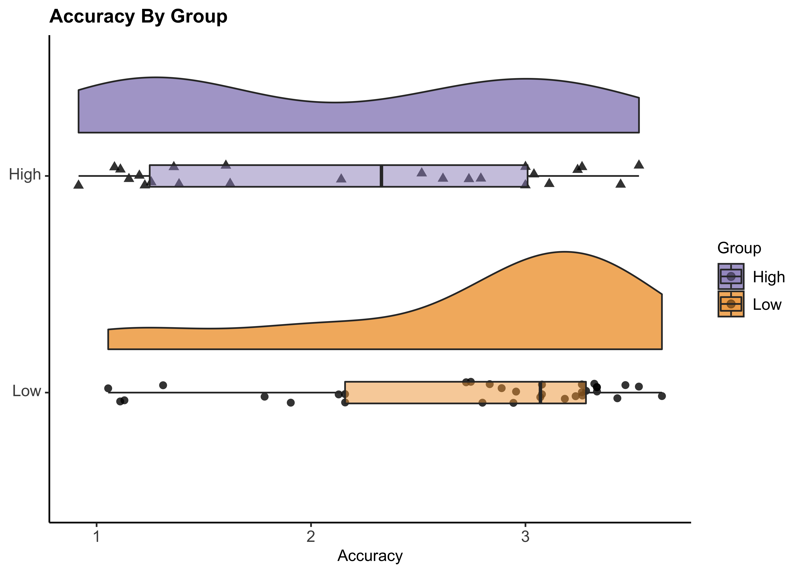
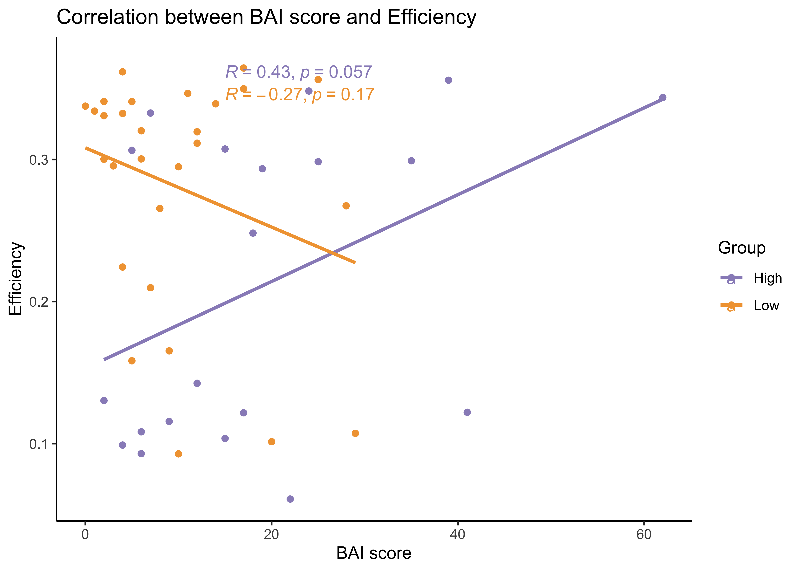
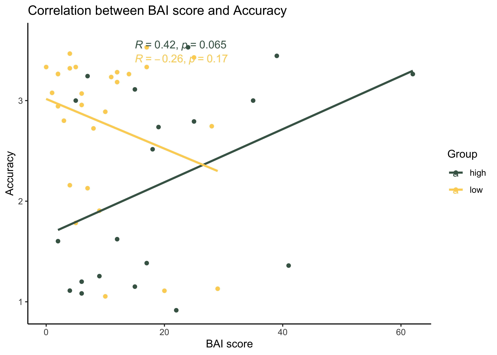

NCP\_Analysis\_Prelim
================
Jadyn Park
1/20/2021

**Research Questions:**  
**1.** Do implicit learning strategies differ between Low NCP and High
NCP?  
**2.** Are clinically relevant traits/symptoms (i.e.,
anxiety/impulsivity) related to the difference in group performance?  
**3.** Do relevant traits contribute to perseveration errors in implicit
learning tasks?

**Research Aims:**  
**Aim 1.** To test group differences in cognitive performance between
Low vs. High NCP  
**Aim 2.** To test if group performance is related to anxious/impulsive
symptoms  
**Aim 3.** To test if anxiety/impulsivity is correlated with
perseveration errors in implicit learning tasks

**Hypotheses:**  
**1.** Low NCPs perform better than high NCPs  
**2.** Greater the BAI (anxiety) & BAS (impulsivity) scores, worse the
performance in tasks  
**3.** Low NCPs perform better (i.e., perseverate less) than high NCPs
and anxious symptoms (potentially) moderate this relationship  
**3.1.** Alternatively, greater anxiety/impulsivity may only affect high
NCP but not low NCP

### This document displays EXTREMELY preliminary results from NCP data.

``` r
#load libraries 
rm(list = ls())
library(knitr); library(kableExtra); library(reshape2); library(tidyverse); library(dplyr); library(effsize); library(tables); library(ggplot2); library(ggpubr); library(RColorBrewer); library(ez); source("~/Desktop/Anxiety NCP/summarySEwithin2.R")

#import data - demographics, self report, and PCET
master.path <- "~/Desktop/Anxiety NCP/Anxiety_NCP_master.csv"
master.data <- read.csv(master.path, header = TRUE)

#import WPT data
wpt.path <- "~/Desktop/Anxiety NCP/Weather Prediction Data/WPT_master.csv"
```

### Demographics

``` r
#demographics
master.data$Group <- "NCP"
master.data$Group[master.data$Subject.ID < 5000] <- "HC"
master.data$Group <- as.factor(master.data$Group)

demo.data <- master.data %>% dplyr::group_by(Group) %>%
  dplyr::summarise(N = sum(!is.na(Subject.ID)),
            meanAge = mean(Age, na.rm = TRUE),
            female = sum(Sex == "Female"),
            male = sum(Sex == "Male"),
            eastAsian = sum(Race == "east asian"),
            white = sum(Race == "white"),
            interracial = sum(Race == "interracial"),
            black = sum(Race == "black"),
            high = sum(Quartile == "high"),
            low = sum(Quartile == "low"))

t_demo.data <- as.data.frame(t(demo.data))
t_demo.data <- t_demo.data[-c(1),]
names(t_demo.data) <- c("count or M", "count or M")
rownames(t_demo.data) <- c("N", "Mean Age", "Female", "Male", 
                           "East Asian", "White", "Interracial", "Black", "High NCP", "Low NCP")

knitr::kable(format(t_demo.data, digits = 5, drop0trailing = TRUE), caption = "Participant Demographics") %>%
  kable_styling(c("striped", full_width = F)) %>%
  add_header_above(c(" " =1, "HC" =1, "NCP" =1)) %>%
  pack_rows("Sex", 3, 4) %>%
  pack_rows("Race", 5, 8) %>%
  pack_rows("NCP group", 9, 10)
```

<table class="table table-striped" style="margin-left: auto; margin-right: auto;">

<caption>

Participant Demographics

</caption>

<thead>

<tr>

<th style="border-bottom:hidden" colspan="1">

</th>

<th style="border-bottom:hidden; padding-bottom:0; padding-left:3px;padding-right:3px;text-align: center; " colspan="1">

<div style="border-bottom: 1px solid #ddd; padding-bottom: 5px; ">

HC

</div>

</th>

<th style="border-bottom:hidden; padding-bottom:0; padding-left:3px;padding-right:3px;text-align: center; " colspan="1">

<div style="border-bottom: 1px solid #ddd; padding-bottom: 5px; ">

NCP

</div>

</th>

</tr>

<tr>

<th style="text-align:left;">

</th>

<th style="text-align:left;">

count or M

</th>

<th style="text-align:left;">

count or M

</th>

</tr>

</thead>

<tbody>

<tr>

<td style="text-align:left;">

N

</td>

<td style="text-align:left;">

69

</td>

<td style="text-align:left;">

66

</td>

</tr>

<tr>

<td style="text-align:left;">

Mean Age

</td>

<td style="text-align:left;">

21.46377

</td>

<td style="text-align:left;">

20.37500

</td>

</tr>

<tr grouplength="2">

<td colspan="3" style="border-bottom: 1px solid;">

<strong>Sex</strong>

</td>

</tr>

<tr>

<td style="text-align:left; padding-left: 2em;" indentlevel="1">

Female

</td>

<td style="text-align:left;">

43

</td>

<td style="text-align:left;">

48

</td>

</tr>

<tr>

<td style="text-align:left; padding-left: 2em;" indentlevel="1">

Male

</td>

<td style="text-align:left;">

26

</td>

<td style="text-align:left;">

16

</td>

</tr>

<tr grouplength="4">

<td colspan="3" style="border-bottom: 1px solid;">

<strong>Race</strong>

</td>

</tr>

<tr>

<td style="text-align:left; padding-left: 2em;" indentlevel="1">

East Asian

</td>

<td style="text-align:left;">

6

</td>

<td style="text-align:left;">

10

</td>

</tr>

<tr>

<td style="text-align:left; padding-left: 2em;" indentlevel="1">

White

</td>

<td style="text-align:left;">

32

</td>

<td style="text-align:left;">

29

</td>

</tr>

<tr>

<td style="text-align:left; padding-left: 2em;" indentlevel="1">

Interracial

</td>

<td style="text-align:left;">

5

</td>

<td style="text-align:left;">

6

</td>

</tr>

<tr>

<td style="text-align:left; padding-left: 2em;" indentlevel="1">

Black

</td>

<td style="text-align:left;">

11

</td>

<td style="text-align:left;">

8

</td>

</tr>

<tr grouplength="2">

<td colspan="3" style="border-bottom: 1px solid;">

<strong>NCP group</strong>

</td>

</tr>

<tr>

<td style="text-align:left; padding-left: 2em;" indentlevel="1">

High NCP

</td>

<td style="text-align:left;">

0

</td>

<td style="text-align:left;">

29

</td>

</tr>

<tr>

<td style="text-align:left; padding-left: 2em;" indentlevel="1">

Low NCP

</td>

<td style="text-align:left;">

34

</td>

<td style="text-align:left;">

37

</td>

</tr>

</tbody>

</table>

### Let’s talk about sex distribution baby

In the high-NCP group, 22 are Female and 6 are Male. In the low NCP
group, 26 are Female and 10 are Male.  
In the healthy control group, all of which were low NCP, 23 were Female
and 11 were Male.  
Given that the sexes are fairly evenly distributed across the four
quartiles, HC group data were not used in this analyses.

``` r
#By quartile
  #CAPE Positive Frequency scores are used to define NCP
  #1st Q: 0-5, 2nd Q: 6-8, 3rd Q: 9-11, 4th Q: 12 and above
  #9(Median) used as a cutoff for median split
  #Low NCP = 1st & 2nd Q, High NCP = 3rd & 4th
quartile <- master.data %>% dplyr::group_by(Group) %>%
  dplyr::summarise(F.1st = sum(Sex == "Female" & Pos_Freq < 6, na.rm = T),
            F.2nd = sum(Sex == "Female" & 5 < Pos_Freq & Pos_Freq < 9, na.rm = T),
            F.3rd = sum(Sex == "Female" & 8 < Pos_Freq & Pos_Freq < 12, na.rm = T),
            F.4th = sum(Sex == "Female" & 11 < Pos_Freq, na.rm = T),
            M.1st = sum(Sex == "Male" & Pos_Freq < 6, na.rm = T),
            M.2nd = sum(Sex == "Male" & 5 < Pos_Freq & Pos_Freq < 9, na.rm = T),
            M.3rd = sum(Sex == "Male" & 8 < Pos_Freq & Pos_Freq < 12, na.rm = T),
            M.4th = sum(Sex == "Male" & 11 < Pos_Freq, na.rm = T))

quartile = select(quartile, -1)
names(quartile) <- c("1st", "2nd", "3rd", "4th", "1st", "2nd", "3rd", "4th")
rownames(quartile) <- c("HC", "NCP")

knitr::kable(quartile, caption = "Gender Distribution by Quartile") %>%
  kable_styling(c("striped", full_width = F)) %>%
  add_header_above(c(" " =1, "Female" =4, "Male" =4))
```

<table class="table table-striped" style="margin-left: auto; margin-right: auto;">

<caption>

Gender Distribution by Quartile

</caption>

<thead>

<tr>

<th style="border-bottom:hidden" colspan="1">

</th>

<th style="border-bottom:hidden; padding-bottom:0; padding-left:3px;padding-right:3px;text-align: center; " colspan="4">

<div style="border-bottom: 1px solid #ddd; padding-bottom: 5px; ">

Female

</div>

</th>

<th style="border-bottom:hidden; padding-bottom:0; padding-left:3px;padding-right:3px;text-align: center; " colspan="4">

<div style="border-bottom: 1px solid #ddd; padding-bottom: 5px; ">

Male

</div>

</th>

</tr>

<tr>

<th style="text-align:left;">

</th>

<th style="text-align:right;">

1st

</th>

<th style="text-align:right;">

2nd

</th>

<th style="text-align:right;">

3rd

</th>

<th style="text-align:right;">

4th

</th>

<th style="text-align:right;">

1st

</th>

<th style="text-align:right;">

2nd

</th>

<th style="text-align:right;">

3rd

</th>

<th style="text-align:right;">

4th

</th>

</tr>

</thead>

<tbody>

<tr>

<td style="text-align:left;">

HC

</td>

<td style="text-align:right;">

18

</td>

<td style="text-align:right;">

5

</td>

<td style="text-align:right;">

0

</td>

<td style="text-align:right;">

0

</td>

<td style="text-align:right;">

9

</td>

<td style="text-align:right;">

2

</td>

<td style="text-align:right;">

0

</td>

<td style="text-align:right;">

0

</td>

</tr>

<tr>

<td style="text-align:left;">

NCP

</td>

<td style="text-align:right;">

16

</td>

<td style="text-align:right;">

10

</td>

<td style="text-align:right;">

6

</td>

<td style="text-align:right;">

16

</td>

<td style="text-align:right;">

5

</td>

<td style="text-align:right;">

5

</td>

<td style="text-align:right;">

3

</td>

<td style="text-align:right;">

3

</td>

</tr>

</tbody>

</table>

``` r
#Master dataset used in current analysis, excludes HC (ID 4XXX) 
data.clean <- master.data[!(master.data$Subject.ID <5000), ]
```

### Self Report Data

Preliminary data suggests CAPE positive frequency scores are positively
correlated with BAI scores

``` r
#Using colorbrewer for da ~aesthetics~
pal <- brewer.pal(12, "Set3")
blue.pal <- brewer.pal(5, "BuPu")
purp.pal <- brewer.pal(8, "Purples")

#Self Report data (CAPE positive & total, LSHS, BAI, BIS, BAS)
selfReport <- data.clean %>% select(Subject.ID, Pos_Freq, CAPE.sum, LSHS.sum, HPS.sum, BAI.sum, BIS.sum, BAS.fun, BAS.reward, BAS.drive, BAS.sum) 

sR.table <- selfReport %>%
  summarise(mean.CAPE = mean(Pos_Freq, na.rm = T),
            mean.LSHS = mean(LSHS.sum, na.rm = T),
            mean.BAI = mean (BAI.sum, na.rm = T),
            mean.BIS = mean(BIS.sum, na.rm = T),
            mean.BAS = mean(BAS.sum, na.rm = T)) %>%
  dplyr::rename("mean CAPE (Pos Freq)" = "mean.CAPE", "mean LSHS" = "mean.LSHS", 
         "mean BAI" = "mean.BAI", "mean BIS" = "mean.BIS", "mean BAS" = "mean.BAS")

knitr::kable(format(sR.table, digits = 5, drop0trailing = TRUE), caption = "Mean Self Report Scores") %>%
  kable_styling(c("striped", "bordered"))
```

<table class="table table-striped table-bordered" style="margin-left: auto; margin-right: auto;">

<caption>

Mean Self Report Scores

</caption>

<thead>

<tr>

<th style="text-align:left;">

mean CAPE (Pos Freq)

</th>

<th style="text-align:left;">

mean LSHS

</th>

<th style="text-align:left;">

mean BAI

</th>

<th style="text-align:left;">

mean BIS

</th>

<th style="text-align:left;">

mean BAS

</th>

</tr>

</thead>

<tbody>

<tr>

<td style="text-align:left;">

8.3939

</td>

<td style="text-align:left;">

10.83

</td>

<td style="text-align:left;">

13.309

</td>

<td style="text-align:left;">

23.696

</td>

<td style="text-align:left;">

38.022

</td>

</tr>

</tbody>

</table>

``` r
# CAPE Positive Frequency vs. BAI
summary(lm(selfReport$BAI.sum~selfReport$Pos_Freq)) #linear regression summary
```

    ## 
    ## Call:
    ## lm(formula = selfReport$BAI.sum ~ selfReport$Pos_Freq)
    ## 
    ## Residuals:
    ##     Min      1Q  Median      3Q     Max 
    ## -20.723  -6.208  -2.981   2.648  40.921 
    ## 
    ## Coefficients:
    ##                     Estimate Std. Error t value Pr(>|t|)   
    ## (Intercept)           6.0995     2.6701   2.284  0.02638 * 
    ## selfReport$Pos_Freq   0.8812     0.2709   3.252  0.00199 **
    ## ---
    ## Signif. codes:  0 '***' 0.001 '**' 0.01 '*' 0.05 '.' 0.1 ' ' 1
    ## 
    ## Residual standard error: 11.04 on 53 degrees of freedom
    ##   (11 observations deleted due to missingness)
    ## Multiple R-squared:  0.1664, Adjusted R-squared:  0.1507 
    ## F-statistic: 10.58 on 1 and 53 DF,  p-value: 0.001993

``` r
ggplot(selfReport, aes(x=Pos_Freq, y=BAI.sum), na.rm = TRUE) + geom_point(color = pal[1]) +
 geom_smooth(method = lm , se = TRUE, color = pal[1]) +
 ggtitle("Correlation between CAPE score (Positive Frequency Only) and BAI score") + 
  xlab("CAPE Positive Frequency score") +
  ylab("BAI score") +
  theme_classic() +
  stat_cor(method = "pearson", label.x = 3, label.y = 30)
```

<!-- -->

### PCET (Penn Conditional Exclusion Task) Performance

Participants are given 48 trials to learn which characteristic (size,
shape, or line thickness) is determining the “odd man out”. They must
get 10 consecutive correct answers. After those correct answers, the
characteristic is changed. The PCET is scored based on a composite of
total correct responses and the number of rules/principles the
participant learned. Specifically, a performance composite score is
calculated by multiplying the number of principles learned (plus 1 to
accommodate those who do not learn a single rule) by proportion of
correct responses (i.e., correct responses/total responses). (Moore et
al., 2019)


``` r
pcet.data <- data.clean %>% select(Subject.ID, Sex, Quartile, PCET_NUM, PCETCR, PCETER, PCETRTCR, PCETRTER, PCET_CAT, CAT1_TR, CAT2_TR, CAT3_TR, PCET_EFF)

# PCET_NUM = total number of responses (correct + incorrect)
# PCETCR = total number of correct responses 
  # keep in mind that the rule changes only when the participant has answered correctly on 10 consecutive trials
  # if a participant makes a mistake, their CR will exceed 30
# PCETER = total number of incorrect responses
# PCET_CAT = number of categories (i.e., rules) achieved
  # if participant never got the rule, CAT = 0
# CAT1_TR = total number of trials (correct + incorrect) took to achieve 1st category
  # this will always include 10 consecutive successful trials
# CAT2_TR = same as CAT1 but for the 2nd category
# CAT3_TR = same as above but for the last category
  # if participant never got the rule, default is to complete 48 trials

pcet.melt <- melt(pcet.data, id.vars = c("Quartile", "Subject.ID"), variable_name="metric") #as a list
pcet.melt <- pcet.melt[!(pcet.melt$variable == "Sex"), ] %>% #excluding sex as a variable
  filter(Quartile == "low" | Quartile == "high")
pcet.melt$value <- as.numeric(pcet.melt$value, na.rm = T) #value as numeric

pcet.fx <- function(data, varname, groupnames){
  require(plyr)
  summary_func <- function(x, col){
    c(mean = mean(x[[col]], na.rm=TRUE),
      sd = sd(x[[col]], na.rm=TRUE))
  }
  data_sum<-ddply(data, groupnames, .fun=summary_func,
                  varname)
  data_sum <- rename(data_sum, c("mean" = varname))
 return(data_sum)
} #function for SummaryWithin2 package -- calculates mean and sd

pcet.summary <- pcet.fx(pcet.melt, varname="value", groupnames=c("Quartile", "variable")) #summarized by quartile & variable (total, correct, incorrect)

# 1. Number of Correct, Incorrect, and Total Trials in High vs. Low NCP
pcet.group1 <- pcet.summary %>% filter(variable == "PCET_NUM" | variable == "PCETCR" | variable == "PCETER")
pcet.group1$variable <- c("PCET_NUM" = "Total", "PCETCR" = "CR", "PCETER" = "IR")

ggplot(pcet.group1, aes(x = variable, y = value, fill = variable)) +
  geom_bar(position = "dodge", stat = "identity") + 
  geom_errorbar(aes(ymin = value-sd, ymax = value+sd), width = .2,
                    position = position_dodge(.9)) +
  facet_grid(.~Quartile) +
  scale_fill_brewer() +
  ggtitle("Mean # Correct and Incorrect Trials in High vs. Low NCP") + 
  xlab("Mean Total, Correct, and Incorrect Responses") +
  ylab("# Trials") +
  labs(fill = "Responses (Total, Correct, Incorrect)") +
  theme(
    panel.background = element_rect(fill = "transparent"), 
    plot.background = element_rect(fill = "transparent", color = NA),
    axis.line.x = element_line(color = "black", size = 0.4),
    axis.line.y = element_line(color = "black", size = 0.4)
  )
```

<!-- -->

``` r
# 1.1 Significance Test
##Total Responses
total.high <- subset(pcet.melt, Quartile == "high" & variable == "PCET_NUM")
total.low <- subset(pcet.melt, Quartile == "low" & variable == "PCET_NUM")
#var.test(total.high$value, total.low$value) ##Fisher's F-test, p<0.05; heterogeneous sample
t.test(total.high$value, total.low$value, var.equal = FALSE) #two-sample t test, p = 0.0117; significant difference in total number of responses between high vs. low NCP
```

    ## 
    ##  Welch Two Sample t-test
    ## 
    ## data:  total.high$value and total.low$value
    ## t = 2.6518, df = 37.18, p-value = 0.0117
    ## alternative hypothesis: true difference in means is not equal to 0
    ## 95 percent confidence interval:
    ##   3.004263 22.450282
    ## sample estimates:
    ## mean of x mean of y 
    ##  63.66667  50.93939

``` r
############# Effect Size #############
high.m = pcet.group1[1,3]
high.n = sum(pcet.melt$Quartile=="high" & pcet.melt$variable=="PCET_NUM")
high.sd =  pcet.group1[1,4]
low.m = pcet.group1[4,3]
low.sd = pcet.group1[4,4]
low.n = sum(pcet.melt$Quartile=="low" & pcet.melt$variable=="PCET_NUM")

mean.diff = high.m - low.m
sd.pooled = sqrt(((high.n-1)*high.sd^2+(low.n-1)*low.sd^2)/(high.n+low.n-2))
cohensD = mean.diff/sd.pooled
############# Cohen's D = 0.7498 #############


##Correct Responses
correct.high <- subset(pcet.melt, Quartile == "high" & variable == "PCETCR")
correct.low <- subset(pcet.melt, Quartile == "low" & variable == "PCETCR")
#var.test(correct.high$value, correct.low$value) #Fisher's F-test, p>0.05; both samples are homogeneous
t.test(correct.high$value, correct.low$value, var.equal = TRUE) #two-sample t-test, p = 0.4882; no significant difference in total number of correct responses between low vs. high NCP
```

    ## 
    ##  Two Sample t-test
    ## 
    ## data:  correct.high$value and correct.low$value
    ## t = 0.69787, df = 55, p-value = 0.4882
    ## alternative hypothesis: true difference in means is not equal to 0
    ## 95 percent confidence interval:
    ##  -2.041791  4.223610
    ## sample estimates:
    ## mean of x mean of y 
    ##  35.33333  34.24242

``` r
###Incorrect Responses
incorr.high <- subset(pcet.melt, Quartile == "high" & variable == "PCETER")
incorr.low <- subset(pcet.melt, Quartile == "low" & variable == "PCETER")
#var.test(incorr.high$value, incorr.low$value) #Fisher's F-test, p>0.05; both samples are homogeneous
t.test(incorr.high$value, incorr.low$value, var.equal = TRUE) #two-sample t-test, p = 0.0069; significant difference in total number of incorrect responses between low vs. high NCP
```

    ## 
    ##  Two Sample t-test
    ## 
    ## data:  incorr.high$value and incorr.low$value
    ## t = 2.8049, df = 55, p-value = 0.006943
    ## alternative hypothesis: true difference in means is not equal to 0
    ## 95 percent confidence interval:
    ##   3.322521 19.950207
    ## sample estimates:
    ## mean of x mean of y 
    ##  28.33333  16.69697

``` r
############# Effect Size #############
high.m = pcet.group1[3,3]
high.n = sum(pcet.melt$Quartile=="high" & pcet.melt$variable=="PCETER")
high.sd =  pcet.group1[3,4]
low.m = pcet.group1[6,3]
low.sd = pcet.group1[6,4]
low.n = sum(pcet.melt$Quartile=="low" & pcet.melt$variable=="PCETER")

mean.diff = high.m-low.m
sd.pooled = sqrt(((high.n-1)*high.sd^2+(low.n-1)*low.sd^2)/(high.n+low.n-2))
cohensD = mean.diff/sd.pooled
############# Cohen's D = 0.7466 #############


# 2. RT of Correct and Incorrect Trials in High vs. Low NCP
pcet.group2 <- pcet.summary %>% filter(variable == "PCETRTCR" | variable == "PCETRTER")
pcet.group2$variable <- c("PCETRTCR" = "RT Correct", "PCETRTER" = "RT Incorrect")

ggplot(pcet.group2, aes(x = variable, y = value, fill = variable)) +
  geom_bar(position = "dodge", stat = "identity") +
  geom_errorbar(aes(ymin = value-sd, ymax = value+sd), width = .2,
                    position = position_dodge(.9)) +
  facet_grid(.~Quartile) +
  scale_fill_brewer() +
  ggtitle("RT of Correct and Incorrect Trials in High vs. Low NCP") + 
  xlab("Mean Correct, and Incorrect Responses") +
  ylab("RT (in ms)") +
  labs(fill = "Responses (Correct, Incorrect)") +
  theme(
    panel.background = element_rect(fill = "transparent"), 
    plot.background = element_rect(fill = "transparent", color = NA),
    axis.line.x = element_line(color = "black", size = 0.4),
    axis.line.y = element_line(color = "black", size = 0.4)
  )
```

<!-- -->

``` r
# 2.1 Significance Test
##Correct Responses
correct.high.rt <- subset(pcet.melt, Quartile == "high" & variable == "PCETRTCR")
correct.low.rt <- subset(pcet.melt, Quartile == "low" & variable == "PCETRTCR")
#var.test(correct.high.rt$value, correct.low.rt$value) #Fisher's F-test, p<0.05; heterogeneous sample
t.test(correct.high.rt$value, correct.low.rt$value, var.equal = FALSE) #Welch t-statistic, p = 0.1104; no significant difference in RT of correct responses between low vs. high NCP 
```

    ## 
    ##  Welch Two Sample t-test
    ## 
    ## data:  correct.high.rt$value and correct.low.rt$value
    ## t = 1.6436, df = 30.855, p-value = 0.1104
    ## alternative hypothesis: true difference in means is not equal to 0
    ## 95 percent confidence interval:
    ##  -62.23829 578.47314
    ## sample estimates:
    ## mean of x mean of y 
    ##  1834.708  1576.591

``` r
##Incorrect Responses
incorr.high.rt <- subset(pcet.melt, Quartile == "high" & variable == "PCETRTER")
incorr.low.rt <- subset(pcet.melt, Quartile == "low" & variable == "PCETRTER")
#var.test(incorr.high.rt$value, incorr.low.rt$value) #Fisher's F-test, p<0.05; heterogeneous sample
t.test(incorr.high.rt$value, incorr.low.rt$value, var.equal = FALSE) #Welch t-statistic, p = 0.0557; no significant difference in RT of incorrect responses between low vs. high NCP 
```

    ## 
    ##  Welch Two Sample t-test
    ## 
    ## data:  incorr.high.rt$value and incorr.low.rt$value
    ## t = 1.9803, df = 34.337, p-value = 0.05573
    ## alternative hypothesis: true difference in means is not equal to 0
    ## 95 percent confidence interval:
    ##   -15.01516 1176.15910
    ## sample estimates:
    ## mean of x mean of y 
    ##  2680.542  2099.970

``` r
############# Effect Size #############
high.m = pcet.group2[2,3]
high.n = sum(pcet.melt$Quartile=="high" & pcet.melt$variable=="PCETRTER")
high.sd =  pcet.group2[2,4]
low.m = pcet.group2[4,3]
low.sd = pcet.group2[4,4]
low.n = sum(pcet.melt$Quartile=="low" & pcet.melt$variable=="PCETRTER")

mean.diff = high.m-low.m
sd.pooled = sqrt(((high.n-1)*high.sd^2+(low.n-1)*low.sd^2)/(high.n+low.n-2))
cohensD = mean.diff/sd.pooled
############# Cohen's D = 0.5671 #############

# 3. Accuracy (% Correct)
pcet.data <- pcet.data %>% mutate(freq = PCETCR/PCET_NUM)
pcet.freq <- melt(pcet.data, id.vars = c("Quartile", "Subject.ID"), variable_name="metric")
pcet.freq <- pcet.freq %>% filter(variable == "freq" & (Quartile == "low" | Quartile == "high"))

h.acc<- pcet.freq %>% filter(Quartile == "high") %>% summarise(n = sum(variable=="freq"),
                                                            mean = mean(as.numeric(value), na.rm = T),
                                                            sd = sd(as.numeric(value), na.rm = T)) #n, mean, and sd of high NCP

l.acc <- pcet.freq %>% filter(Quartile == "low") %>% summarise(n = sum(variable=="freq"),
                                                           mean = mean(as.numeric(value), na.rm = T),
                                                           sd = sd(as.numeric(value), na.rm = T)) #n, mean, and sd of low NCP

high.freq <- data.frame(hf = rnorm(h.acc$n, h.acc$mean, h.acc$sd)) # normalized
low.freq <- data.frame(lf = rnorm(l.acc$n, l.acc$mean, l.acc$sd))

ggplot() +
  geom_density(data = high.freq, aes(x = hf),
               fill = "#E6E6FA", color = "black", alpha = .5) +
  geom_density(data = low.freq, aes(x = lf),
               fill = "#FFDAB9", color = "black", alpha = .5) +
  theme_classic() +
  ggtitle("Accuracy (% Correct) in high vs. low NCP") +
  xlab("Accuracy (% Correct)") 
```

<!-- -->

``` r
# 3.1 Box Plot
ggplot(pcet.freq, aes(x=variable, y=as.numeric(value), fill = Quartile), na.rm = TRUE) +
  geom_boxplot(position = position_dodge()) +
  geom_dotplot(binaxis='y', stackdir='center', dotsize=.5, position = position_dodge()) +
  theme_classic() +
  scale_fill_manual(values = c("#E6E6FA", "#FFDAB9")) +
  labs(title = "Accuracy by Group", y = "Accuracy")
```

<!-- -->

``` r
# 3.2 Significance Test
freq.high <- subset(pcet.freq, Quartile == "high")
freq.low <- subset(pcet.freq, Quartile == "low")
#var.test(as.numeric(freq.high$value), as.numeric(freq.low$value)) #Fisher's F-test, p>0.05; homogeneous sample
#t.test(as.numeric(freq.high$value), as.numeric(freq.low$value, var.equal = TRUE)) # p = 0.020


# 4. Efficiency
pcet.eff <- pcet.melt %>% filter(variable=="PCET_EFF")

h.eff <- pcet.eff %>% filter(Quartile == "high") %>% summarise(n = sum(variable=="PCET_EFF"),
                                                            mean = mean(as.numeric(value), na.rm = T),
                                                            sd = sd(as.numeric(value), na.rm = T)) #n, mean, and sd of high NCP

l.eff <- pcet.eff %>% filter(Quartile == "low") %>% summarise(n = sum(variable=="PCET_EFF"),
                                                           mean = mean(as.numeric(value), na.rm = T),
                                                           sd = sd(as.numeric(value), na.rm = T)) #n, mean, and sd of low NCP

high.eff <- data.frame(he = rnorm(h.eff$n, h.eff$mean, h.eff$sd)) # normalized
low.eff <- data.frame(le = rnorm(l.eff$n, l.eff$mean, l.eff$sd))

ggplot() +
  geom_density(data = high.eff, aes(x = he),
               fill = "#E6E6FA", color = "black", alpha = .5) +
  geom_density(data = low.eff, aes(x = le),
               fill = "#FFDAB9", color = "black", alpha = .5) +
  theme_classic() +
  ggtitle("Efficiency in high vs. low NCP") +
  xlab("Efficiency") 
```

<!-- -->

``` r
# 4.1 Box Plot
ggplot(pcet.eff, aes(x=variable, y=as.numeric(value), fill = Quartile), na.rm = TRUE) +
  geom_boxplot(position = position_dodge()) +
  geom_dotplot(binaxis='y', stackdir='center', dotsize=.5, position = position_dodge()) +
  theme_classic() +
  scale_fill_manual(values = c("#E6E6FA", "#FFDAB9")) +
  labs(title = "Efficiency by Group", y = "Efficiency")
```

<!-- -->

``` r
# 4.2 Significance Test
eff.high <- subset(pcet.eff, Quartile == "high")
eff.low <- subset(pcet.eff, Quartile == "low")
#var.test(eff.high$value, eff.low$value) #Fisher's F-test, p>0.05; homogeneous sample
#t.test(eff.high$value, eff.low$value, var.equal = TRUE) #p=0.0123

# 5. Composite score
pcet.data <- pcet.data %>% mutate(score = PCET_CAT * freq)
pcet.score <- melt(pcet.data, id.vars = c("Quartile", "Subject.ID"), variable_name="metric") 
pcet.score <- pcet.score %>% filter(variable == "score" & (Quartile == "low" | Quartile == "high")) 

h.sc <- pcet.score %>% filter(Quartile == "high") %>% summarise(n = sum(variable=="score"),
                                                            mean = mean(as.numeric(value), na.rm = T),
                                                            sd = sd(as.numeric(value), na.rm = T)) #n, mean, and sd of high NCP

l.sc <- pcet.score %>% filter(Quartile == "low") %>% summarise(n = sum(variable=="score"),
                                                           mean = mean(as.numeric(value), na.rm = T),
                                                           sd = sd(as.numeric(value), na.rm = T)) #n, mean, and sd of low NCP

high.score <- data.frame(hs = rnorm(h.sc$n, h.sc$mean, h.sc$sd)) # normalized
low.score <- data.frame(ls = rnorm(l.sc$n, l.sc$mean, l.sc$sd))

ggplot() +
  geom_density(data = high.score, aes(x = hs),
               fill = "#E6E6FA", color = "black", alpha = .5) +
  geom_density(data = low.score, aes(x = ls),
               fill = "#FFDAB9", color = "black", alpha = .5) +
  theme_classic() +
  ggtitle("Composite Score in high vs. low NCP") +
  xlab("Score") 
```

<!-- -->

``` r
# 5.1 Box Plot
ggplot(pcet.score, aes(x=variable, y=as.numeric(value), fill = Quartile), na.rm = TRUE) +
  geom_boxplot(position = position_dodge()) +
  geom_dotplot(binaxis='y', stackdir='center', dotsize=.5, position = position_dodge()) +
  theme_classic() +
  scale_fill_manual(values = c("#E6E6FA", "#FFDAB9")) +
  labs(title = "Composite Score by Group", y = "Score")
```

<!-- -->

``` r
# 5.1 Significance Test
score.high <- subset(pcet.score, Quartile == "high")
score.low <- subset(pcet.score, Quartile == "low")
#var.test(as.numeric(score.high$value), as.numeric(score.low$value)) #homogeneous
#t.test(as.numeric(score.high$value), as.numeric(score.low$value), var.equal=T) #p=0.014
```

### PCET Performance by Block

``` r
pcet.melt <- pcet.melt %>% select(Quartile, variable, value)
pcet.block <- pcet.melt %>% filter(variable == c("CAT1_TR", "CAT2_TR", "CAT3_TR")) %>%
  dplyr::group_by(Quartile, variable) %>%
  dplyr::summarise(Trials = mean(value, na.rm = T))

#Number of Trials by Block
ggplot(pcet.block, aes(x = variable, y = Trials, group = Quartile)) +
  geom_line(aes(linetype = Quartile, color = Quartile)) +
  geom_point() +
  scale_color_brewer(palette = "Accent") +
  theme_classic()
```

<!-- -->

### PCET & Clinical Traits

``` r
#PCET Performance Type vs. CAPE Positive frequency
data.clean <- data.clean %>% mutate(freq = as.numeric(PCETCR/PCET_NUM), score = as.numeric(PCET_CAT * freq) )
pcet.traits <- data.clean %>% select(Pos_Freq, PCET_EFF, freq, score) %>% drop_na()
pcet.traits <- melt(pcet.traits, id.vars = "Pos_Freq")
pcet.traits$variable <- c("PCET_EFF" = "Efficiency", "freq" = "Accuracy", "score" = "Score")

ggplot(pcet.traits, aes(x = Pos_Freq, y = value, col = variable)) + geom_point() +
  geom_smooth(method = lm , se = F) +
  scale_color_brewer(palette = "Accent") +
  labs(title = "Correlation between CAPE positive score and Performance", x = "CAPE Positive Score", y = "value") +
  theme_classic() +
  stat_cor(label.x = 15)
```

<!-- -->

``` r
#BAI vs. Accuracy by Group
ggplot(data.clean, aes(x = BAI.sum, y = freq, col = Quartile), na.rm = T) + geom_point() +
  geom_smooth(method = lm , se = F) +
  scale_color_brewer(palette = "Accent") +
  labs(title = "Correlation between BAI score and Accuracy", x = "BAI score", y = "Accuracy") +
  theme_classic() +
  stat_cor(label.x = 15)
```

<!-- -->

``` r
# Does Group x Anxiety Interaction predict Accuracy?
  # X = Anxiety Score, # D = Group (1 = high NCP, 0 = low NCP) # Y = Accuracy
  # Yi = B0 + B1Xi + B2Xi + ui

summary(lm(data = data.clean, freq ~ BAI.sum * Quartile))
```

    ## 
    ## Call:
    ## lm(formula = freq ~ BAI.sum * Quartile, data = data.clean)
    ## 
    ## Residuals:
    ##      Min       1Q   Median       3Q      Max 
    ## -0.36202 -0.13048  0.02811  0.09604  0.27318 
    ## 
    ## Coefficients:
    ##                      Estimate Std. Error t value Pr(>|t|)    
    ## (Intercept)          0.500528   0.057719   8.672 4.47e-11 ***
    ## BAI.sum              0.005300   0.002379   2.228   0.0311 *  
    ## Quartilelow          0.263472   0.074746   3.525   0.0010 ** 
    ## BAI.sum:Quartilelow -0.010363   0.004467  -2.320   0.0250 *  
    ## ---
    ## Signif. codes:  0 '***' 0.001 '**' 0.01 '*' 0.05 '.' 0.1 ' ' 1
    ## 
    ## Residual standard error: 0.1585 on 44 degrees of freedom
    ##   (18 observations deleted due to missingness)
    ## Multiple R-squared:  0.2233, Adjusted R-squared:  0.1703 
    ## F-statistic: 4.216 on 3 and 44 DF,  p-value: 0.0105

``` r
#BAI vs. Efficiency by Group
ggplot(data.clean, aes(x = BAI.sum, y = PCET_EFF, col = Quartile), na.rm = T) + geom_point() +
  geom_smooth(method = lm , se = F) +
  scale_color_brewer(palette = "Accent") +
  labs(title = "Correlation between BAI score and Efficiency", x = "BAI score", y = "Efficiency") +
  theme_classic() +
  stat_cor(label.x = 15)
```

<!-- -->

``` r
# Does Group x Anxiety Interaction predict Efficiency?
summary(lm(data = data.clean, PCET_EFF ~ BAI.sum*Quartile))
```

    ## 
    ## Call:
    ## lm(formula = PCET_EFF ~ BAI.sum * Quartile, data = data.clean)
    ## 
    ## Residuals:
    ##      Min       1Q   Median       3Q      Max 
    ## -0.18753 -0.06787  0.02841  0.06573  0.15829 
    ## 
    ## Coefficients:
    ##                      Estimate Std. Error t value Pr(>|t|)    
    ## (Intercept)          0.153017   0.032776   4.669 2.86e-05 ***
    ## BAI.sum              0.003056   0.001351   2.262 0.028699 *  
    ## Quartilelow          0.155203   0.042444   3.657 0.000679 ***
    ## BAI.sum:Quartilelow -0.005845   0.002536  -2.304 0.025978 *  
    ## ---
    ## Signif. codes:  0 '***' 0.001 '**' 0.01 '*' 0.05 '.' 0.1 ' ' 1
    ## 
    ## Residual standard error: 0.08999 on 44 degrees of freedom
    ##   (18 observations deleted due to missingness)
    ## Multiple R-squared:  0.2382, Adjusted R-squared:  0.1863 
    ## F-statistic: 4.587 on 3 and 44 DF,  p-value: 0.007031

``` r
#BAI vs. Score by Group
ggplot(data.clean, aes(x = BAI.sum, y = score, col = Quartile), na.rm = T) + geom_point() +
  geom_smooth(method = lm , se = F) +
  scale_color_brewer(palette = "Accent") +
  labs(title = "Correlation between BAI score and Composite Score", x = "BAI score", y = "Composite Score") +
  theme_classic() +
  stat_cor(label.x = 15)
```

<!-- -->

``` r
# Does Group x Anxiety Interaction predict Composite Score?
summary(lm(data = data.clean, score ~ BAI.sum*Quartile))
```

    ## 
    ## Call:
    ## lm(formula = score ~ BAI.sum * Quartile, data = data.clean)
    ## 
    ## Residuals:
    ##     Min      1Q  Median      3Q     Max 
    ## -1.3532 -0.5146  0.1394  0.4118  1.1244 
    ## 
    ## Coefficients:
    ##                      Estimate Std. Error t value Pr(>|t|)    
    ## (Intercept)          1.160502   0.237541   4.885 1.41e-05 ***
    ## BAI.sum              0.021076   0.009791   2.153 0.036881 *  
    ## Quartilelow          1.091805   0.307614   3.549 0.000933 ***
    ## BAI.sum:Quartilelow -0.040721   0.018383  -2.215 0.031970 *  
    ## ---
    ## Signif. codes:  0 '***' 0.001 '**' 0.01 '*' 0.05 '.' 0.1 ' ' 1
    ## 
    ## Residual standard error: 0.6522 on 44 degrees of freedom
    ##   (18 observations deleted due to missingness)
    ## Multiple R-squared:  0.228,  Adjusted R-squared:  0.1753 
    ## F-statistic: 4.331 on 3 and 44 DF,  p-value: 0.009264
