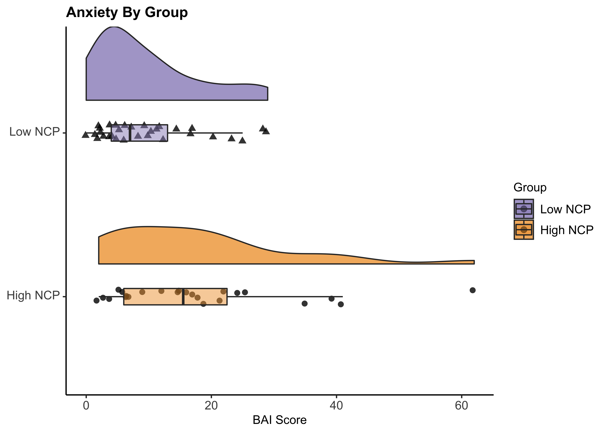
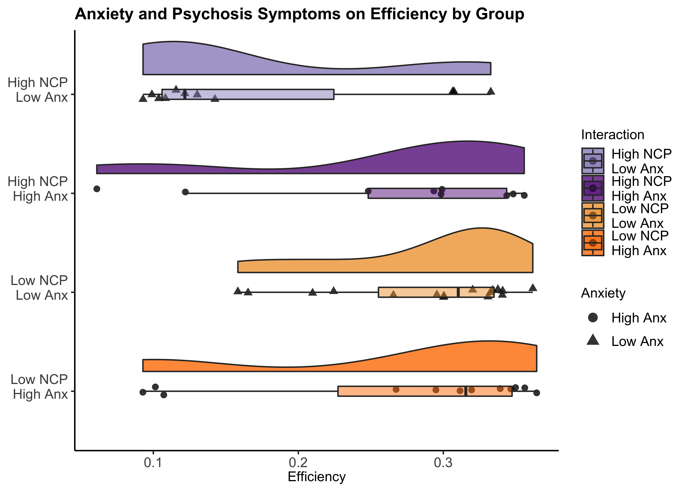
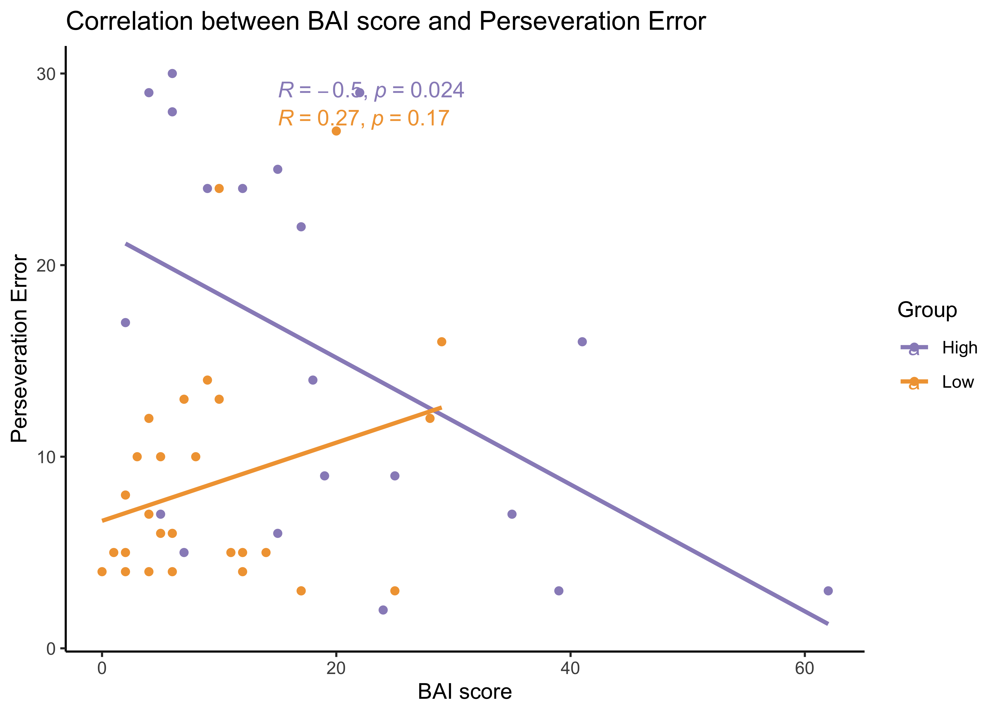

NCP\_Analysis\_Prelim
================
Jadyn Park
1/20/2021

**Research Questions:**  
**1.** Do High-NCP and Low-NCP groups perform differently in a cognitive
task?  
**2.** Are clinically relevant traits/symptoms (i.e., anxiety) related
to the difference in group performance?  
**3.** Do relevant traits contribute to perseveration errors in implicit
learning tasks?

**Research Aims:**  
**Aim 1.** To test group differences in cognitive performance (accuracy,
efficiency) in Low vs. High NCP  
**Aim 2.** To test if group performance is related to clinically
relevant traits (e.g., anxiety)  
**Aim 3.** To test if relevant traits are correlated with perseveration
errors in a rule-learning task

**Hypotheses:**  
**1.** Low NCPs perform better than high NCPs  
**2.** Greater the BAI (anxiety) scores, worse the performance  
**3.** Low NCPs perseverate less than high NCPs and anxiety symptoms are
correlated with this relationship  
**3.1.** Alternatively, greater anxiety may only affect high NCP but not
low NCP

``` r
#load libraries 
rm(list = ls())
library(knitr); library(kableExtra); library(reshape2); library(tidyverse); library(dplyr); library(effsize);library(rstatix); library(tables); library(ggplot2); library(ggpubr); library(RColorBrewer); library(ez); source("~/Desktop/Anxiety NCP/summarySEwithin2.R"); library(wesanderson); library(forcats)

#import data - demographics, self report, and PCET
data <- read.csv("~/Desktop/Anxiety NCP/Anxiety_NCP_master.csv", header = TRUE)
```

### Demographics

``` r
# Demographics
demo <- data %>% group_by(Group) %>%
  dplyr::summarise(N = sum(!is.na(Subject.ID)),
            meanAge = round(mean(Age, na.rm = TRUE), 3),
            sdAge = round(sd(Age, na.rm = TRUE), 3),
            female = sum(Sex == "F"),
            male = sum(Sex == "M"),
            eastAsian = sum(Race == "east asian"),
            white = sum(Race == "white"),
            interracial = sum(Race == "interracial"),
            black = sum(Race == "black"),
  )

demo <- data.frame(t(demo)) # transpose
demo <- demo[2:10,]
colnames(demo) <- c("High NCP", "Low NCP") # column names
rownames(demo) <- c("N", "Mean", "SD", "Female", "Male", 
                           "East Asian", "White", "Interracial", "Black") # row names

knitr::kable(format(demo, digits = 3, drop0trailing = TRUE), caption = "Participant Demographics") %>%
  kable_styling(c("striped", full_width = F)) %>%
  pack_rows("Count", 1, 1) %>%
  pack_rows("Age", 2, 3) %>%
  pack_rows("Sex", 4, 5) %>%
  pack_rows("Race", 6, 9) 
```

<table class="table table-striped" style="margin-left: auto; margin-right: auto;">
<caption>
Participant Demographics
</caption>
<thead>
<tr>
<th style="text-align:left;">
</th>
<th style="text-align:left;">
High NCP
</th>
<th style="text-align:left;">
Low NCP
</th>
</tr>
</thead>
<tbody>
<tr grouplength="1">
<td colspan="3" style="border-bottom: 1px solid;">
<strong>Count</strong>
</td>
</tr>
<tr>
<td style="text-align:left; padding-left: 2em;" indentlevel="1">
N
</td>
<td style="text-align:left;">
29
</td>
<td style="text-align:left;">
37
</td>
</tr>
<tr grouplength="2">
<td colspan="3" style="border-bottom: 1px solid;">
<strong>Age</strong>
</td>
</tr>
<tr>
<td style="text-align:left; padding-left: 2em;" indentlevel="1">
Mean
</td>
<td style="text-align:left;">
20.786
</td>
<td style="text-align:left;">
20.056
</td>
</tr>
<tr>
<td style="text-align:left; padding-left: 2em;" indentlevel="1">
SD
</td>
<td style="text-align:left;">
1.95
</td>
<td style="text-align:left;">
1.97
</td>
</tr>
<tr grouplength="2">
<td colspan="3" style="border-bottom: 1px solid;">
<strong>Sex</strong>
</td>
</tr>
<tr>
<td style="text-align:left; padding-left: 2em;" indentlevel="1">
Female
</td>
<td style="text-align:left;">
22
</td>
<td style="text-align:left;">
26
</td>
</tr>
<tr>
<td style="text-align:left; padding-left: 2em;" indentlevel="1">
Male
</td>
<td style="text-align:left;">
6
</td>
<td style="text-align:left;">
10
</td>
</tr>
<tr grouplength="4">
<td colspan="3" style="border-bottom: 1px solid;">
<strong>Race</strong>
</td>
</tr>
<tr>
<td style="text-align:left; padding-left: 2em;" indentlevel="1">
East Asian
</td>
<td style="text-align:left;">
6
</td>
<td style="text-align:left;">
4
</td>
</tr>
<tr>
<td style="text-align:left; padding-left: 2em;" indentlevel="1">
White
</td>
<td style="text-align:left;">
7
</td>
<td style="text-align:left;">
22
</td>
</tr>
<tr>
<td style="text-align:left; padding-left: 2em;" indentlevel="1">
Interracial
</td>
<td style="text-align:left;">
3
</td>
<td style="text-align:left;">
3
</td>
</tr>
<tr>
<td style="text-align:left; padding-left: 2em;" indentlevel="1">
Black
</td>
<td style="text-align:left;">
6
</td>
<td style="text-align:left;">
2
</td>
</tr>
</tbody>
</table>

### Let’s talk about sex distribution baby

Conducting Chi-square test to test the independence between two
variables – (1) Group (high vs. low), (2) Sex (M vs. F)

``` r
# Chi-square to test whether group is independent from sex
test <- chisq.test(table(data$Group, data$Sex))
X_squared = test[["statistic"]]; df = test[["parameter"]]; p.value = test[["p.value"]]; method = test[["method"]]
test.frame <- data.frame(X_squared, df, p.value, method)
row.names(test.frame) <- NULL

knitr::kable(format(test.frame, digits = 5, drop0trailing = TRUE), 
             caption = "p-value > .05, Group (High vs. Low) and Sex (M vs. F) are independent") %>% 
             kable_styling(c("striped", "bordered", full_width = F))
```

<table class="table table-striped table-bordered" style="margin-left: auto; margin-right: auto;">
<caption>
p-value &gt; .05, Group (High vs. Low) and Sex (M vs. F) are independent
</caption>
<thead>
<tr>
<th style="text-align:left;">
X\_squared
</th>
<th style="text-align:left;">
df
</th>
<th style="text-align:left;">
p.value
</th>
<th style="text-align:left;">
method
</th>
</tr>
</thead>
<tbody>
<tr>
<td style="text-align:left;">
0.36906
</td>
<td style="text-align:left;">
2
</td>
<td style="text-align:left;">
0.8315
</td>
<td style="text-align:left;">
Pearson’s Chi-squared test
</td>
</tr>
</tbody>
</table>

``` r
test2 <- chisq.test(table(data$Group, data$Age))

# Chi-square to test whether Group is independent from sex
  # CAPE Positive Frequency scores are used to define NCP
  # 1st Q: 0-5, 2nd Q: 6-8, 3rd Q: 9-11, 4th Q: 12 and above
  # 9(Median) used as a cutoff for median split
  # Low NCP = 1st & 2nd Q, High NCP = 3rd & 4th
data$Quartile <- ifelse(data$Pos_Freq < 6, "1st",
                         ifelse(5<data$Pos_Freq & data$Pos_Freq<9, "2nd",
                          ifelse(8<data$Pos_Freq & data$Pos_Freq<12, "3rd",
                           ifelse(11<data$Pos_Freq, "4th", NA))))

data <- data[, c(1:5, 52, 6:51)] # reordering columns so that Quartile column is next to CAPE score

test2 <- chisq.test(table(data$Sex, data$Quartile))
X_squared = test2[["statistic"]]; df = test2[["parameter"]]; p.value = test2[["p.value"]]; method = test2[["method"]]
test2.frame <- data.frame(X_squared, df, p.value, method)
row.names(test2.frame) <- NULL

knitr::kable(format(test2.frame, digits = 5, drop0trailing = TRUE), 
             caption = "p-value > .05, Quartiles (1, 2, 3, 4)) and Sex (M vs. F) are independent") %>% 
             kable_styling(c("striped", "bordered", full_width = F))
```

<table class="table table-striped table-bordered" style="margin-left: auto; margin-right: auto;">
<caption>
p-value &gt; .05, Quartiles (1, 2, 3, 4)) and Sex (M vs. F) are
independent
</caption>
<thead>
<tr>
<th style="text-align:left;">
X\_squared
</th>
<th style="text-align:left;">
df
</th>
<th style="text-align:left;">
p.value
</th>
<th style="text-align:left;">
method
</th>
</tr>
</thead>
<tbody>
<tr>
<td style="text-align:left;">
2.9604
</td>
<td style="text-align:left;">
6
</td>
<td style="text-align:left;">
0.8138
</td>
<td style="text-align:left;">
Pearson’s Chi-squared test
</td>
</tr>
</tbody>
</table>

### Self Report Data

``` r
#Self Report data (CAPE positive & total, LSHS, BAI, BIS, BAS)
SR <- data %>% select(Subject.ID, Group, Pos_Freq, CAPE.sum, LSHS.sum, HPS.sum, BAI.sum, BIS.sum, BAS.fun, BAS.reward, BAS.drive, BAS.sum) 

# BAI-CAPE regression graph 
ggplot(SR, aes(x=Pos_Freq, y=BAI.sum, col = Group)) + 
 geom_point() +
  geom_smooth(method = lm , se = TRUE) +
   labs(title = "Correlation between CAPE score (Positive Frequency Only) and BAI score",
       x = "CAPE Positive Frequency score", y = "BAI score") +
  theme_classic() +
  stat_cor(method = "pearson", label.x = c(12, 3), label.y = c(30, 30)) +
  scale_color_manual(values = c("#998ec3", "#f1a340")) 
```

<!-- -->

Significant main effect of group on anxiety such that the high-NCP group
endorsed more anxiety symptoms than the low-NCP group

``` r
# Linear Regression Summary 
summary(lm(data$BAI.sum~data$Group)) #p<.05; significant main effect of group on anxiety such that the low-NCP group has significantly lower BAI scores than the high-NCP group
```

    ## 
    ## Call:
    ## lm(formula = data$BAI.sum ~ data$Group)
    ## 
    ## Residuals:
    ##     Min      1Q  Median      3Q     Max 
    ## -15.875  -7.774  -2.774   4.175  44.125 
    ## 
    ## Coefficients:
    ##               Estimate Std. Error t value Pr(>|t|)    
    ## (Intercept)     17.875      2.322   7.697 3.42e-10 ***
    ## data$GroupLow   -8.101      3.093  -2.619   0.0115 *  
    ## ---
    ## Signif. codes:  0 '***' 0.001 '**' 0.01 '*' 0.05 '.' 0.1 ' ' 1
    ## 
    ## Residual standard error: 11.38 on 53 degrees of freedom
    ##   (11 observations deleted due to missingness)
    ## Multiple R-squared:  0.1146, Adjusted R-squared:  0.09787 
    ## F-statistic: 6.858 on 1 and 53 DF,  p-value: 0.01148

### PCET (Penn Conditional Exclusion Task) Performance

#### PCET Output Variables

PCET\_NUM = total number of responses (correct + incorrect)  
PCETCR = total number of correct responses  
PCETER = total number of incorrect responses  
PCET\_CAT = number of categories achieved (shape, line thickness,
size)  
CAT(1, 2, 3)\_TR = correct + incorrect number of trials to achieve 1st,
2nd, 3rd category  
PER\_ER = measure of perseverative error  
PER\_RES = measure perseverative responses (which could theoretically
include spontaneous correct responses)  
PCET\_EFF = efficiency (PCET Efficiency = PCET\_ACC/log(PCET\_RTCR))  
PCET\_ACC = accuracy (PCET Accuracy = PCET\_CAT \* PCET\_CR/(PCET\_CR
+PCET\_ER))  
PCET\_ACC2 = PCET Accuracy2 = (PCET\_CAT + 1) \* PCET\_CR/(PCET\_CR
+PCET\_ER) (if they have not learned a single rule)  
\*The use of PCET\_ACC has been deprecated

### Performance based on Accuracy, Efficiency, and Perseveration Error

``` r
pcet <- data %>% select(Subject.ID, Group, PCETER, PCETRTCR, PCETRTER, PCET_CAT, CAT1_TR, CAT2_TR, CAT3_TR, PCET_EFF, PER_ER, PCET_ACC2)
high <- pcet %>% filter(Group == "High") #subset of high-NCP
low <- pcet %>% filter(Group == "Low") #subset of low-NCP
pcet$Group <- factor(pcet$Group, levels = c("Low", "High")) # "Group" variable w/ 2 factors

data <- read.csv("~/Desktop/Anxiety NCP/Anxiety_NCP_master.csv", header = TRUE)

library(outliers)
##### 1. Category Achieved #####
# N, mean, and SD of high-NCP
h.cat <- pcet %>% filter(Group == "High") %>% summarise(n = sum(Group=="High" & !is.na(PCET_CAT)),
                                                       mean = mean(PCET_CAT, na.rm = T),
                                                       sd = sd(PCET_CAT, na.rm = T)) 
# N, mean, and SD of low-NCP
l.cat <- pcet %>% filter(Group == "Low") %>% summarise(n = sum(Group=="Low" & !is.na(PCET_CAT)),
                                                       mean = mean(PCET_CAT, na.rm = T),
                                                       sd = sd(PCET_CAT, na.rm = T)) 

# Significance Test
#var.test(High$PCET_CAT, low$PCET_CAT) #P<.05, heterogeneous sample
cat.t <- t.test(high$PCET_CAT, low$PCET_CAT, var.equal=F) # t-test rather than ANOVA because I'm comparing two samples (high vs. low)
cat.d <- cohen.d(high$PCET_CAT, low$PCET_CAT, na.rm=T)

##### 2. Accuracy (PCET_ACC) #####
# N, mean, and SD of high-NCP
h.acc<- pcet %>% filter(Group == "High") %>% summarise(n = sum(Group=="High" & !is.na(PCET_CAT)),
                                                       mean = mean(PCET_ACC2, na.rm = T),
                                                       sd = sd(PCET_ACC2, na.rm = T)) 

# N, mean, and SD of low-NCP
l.acc <- pcet %>% filter(Group == "Low") %>% summarise(n = sum(Group=="Low" & !is.na(PCET_CAT)),
                                                           mean = mean(PCET_ACC2, na.rm = T),
                                                           sd = sd(PCET_ACC2, na.rm = T)) 
  
# Accuracy Plot
#grouplabs <- c("Low NCP", "High NCP")
pcet %>% 
  ggplot(aes(x = Group, y = PCET_ACC2, fill = Group)) + 
  geom_flat_violin(position = position_nudge(x = .2, y = 0),
                   alpha = .8) +
  geom_point(aes(shape = Group),
             position = position_jitter(width = .05),
             size = 2, alpha = 0.8) +
  geom_boxplot(width = .1, outlier.shape = NA, alpha = 0.5) +
  coord_flip() +
  labs(title = "Accuracy By Group",
       y = "Accuracy") +
  theme_classic() +
  scale_fill_manual(values = c("#f1a340","#998ec3")) +
  guides(fill = guide_legend(reverse=TRUE), shape = FALSE) +
  raincloud_theme
```

<!-- -->

``` r
# Significance Test of Accuracy by Group
#var.test(High$PCET_ACC, low$PCET_ACC) #Fisher's F-test, p>0.05; homogeneous sample
acc.t <- t.test(high$PCET_ACC2, low$PCET_ACC2, var.equal = TRUE) #p<.05
acc.d <- cohen.d(high$PCET_ACC2, low$PCET_ACC2, na.rm = T)

# 3. Efficiency (PCET_EFF)
# N, mean, and SD of high-NCP
h.eff <- pcet %>% filter(Group == "High") %>% summarise(n = sum(Group=="High" & !is.na(PCET_CAT)),
                                                        mean = mean(PCET_EFF, na.rm = T),
                                                        sd = sd(PCET_EFF, na.rm = T)) 
# N, mean, and SD of low-NCP
l.eff <- pcet %>% filter(Group == "Low") %>% summarise(n = sum(Group=="Low" & !is.na(PCET_CAT)),
                                                           mean = mean(PCET_EFF, na.rm = T),
                                                           sd = sd(PCET_EFF, na.rm = T)) 
# Efficiency Raincloud Plot
pcet %>% 
  ggplot(aes(x = Group, y = PCET_EFF, fill = Group)) + 
  geom_flat_violin(position = position_nudge(x = .2, y = 0),
                   alpha = .8) +
  geom_point(aes(shape = Group),
             position = position_jitter(width = .05),
             size = 2, alpha = 0.8) +
  geom_boxplot(width = .1, outlier.shape = NA, alpha = 0.5) +
  #scale_x_discrete(labels=grouplabs) +
  coord_flip() +
  labs(title = "Efficiency By Group",
       y = "Efficiency") +
  theme_classic() +
  scale_fill_manual(values = c("#f1a340","#998ec3")) +
  guides(fill = guide_legend(reverse=TRUE), shape = FALSE) +
  raincloud_theme
```

<!-- -->

``` r
# Significance Test of Efficiency by Group 
#var.test(high$PCET_EFF, low$PCET_EFF) #Fisher's F-test, p>0.05; homogeneous sample
eff.t <- t.test(high$PCET_EFF, low$PCET_EFF, var.equal = TRUE) 
eff.d <- cohen.d(high$PCET_EFF, low$PCET_EFF, na.rm = T)

# 4. Perseveration Error Rate (PER_ER)
# N, mean, and SD of high-NCP
h.err <- pcet %>% filter(Group == "High") %>% summarise(n = sum(Group=="High" & !is.na(PCET_CAT)),
                                                            mean = mean(PER_ER, na.rm = T),
                                                            sd = sd(PER_ER, na.rm = T))
# N, mean, and SD of low-NCP
l.err <- pcet %>% filter(Group == "Low") %>% summarise(n = sum(Group=="Low" & !is.na(PCET_CAT)),
                                                           mean = mean(PER_ER, na.rm = T),
                                                           sd = sd(PER_ER, na.rm = T)) 

# Perseveration Raincloud Plot
pcet %>% 
  ggplot(aes(x = Group, y = PER_ER, fill = Group)) + 
  geom_flat_violin(position = position_nudge(x = .2, y = 0),
                   alpha = .8) +
  geom_point(aes(shape = Group),
             position = position_jitter(width = .05),
             size = 2, alpha = 0.8) +
  geom_boxplot(width = .1, outlier.shape = NA, alpha = 0.5) +
  #scale_x_discrete(labels=grouplabs) +
  coord_flip() +
  labs(title = "Perseveration Errors By Group",
       y = "# of Perseverative Responses") +
  theme_classic() +
  scale_fill_manual(values = c("#f1a340","#998ec3")) +
  guides(fill = guide_legend(reverse=TRUE), shape = FALSE) +
  raincloud_theme
```

<!-- -->

``` r
# Significance Test of Perseveration Error by Group
#var.test(as.numeric(score.high$value), as.numeric(score.low$value)) #homogeneous
error.t <- t.test(high$PER_ER, low$PER_ER, var.equal=T) #p=0.014
error.d <- cohen.d(high$PER_ER, low$PER_ER, na.rm = T)

# Summary Table
h.cat = paste(round(h.cat['mean'], 2), "(", round(h.cat['sd'], 2), ")", sep = "")
l.cat = paste(round(l.cat['mean'], 2), "(", round(l.cat['sd'], 2), ")", sep = "")
h.acc.sum = paste(round(h.acc['mean'], 2), "(" , round(h.acc['sd'], 2), ")", sep = "")
h.eff.sum = paste(round(h.eff['mean'], 2), "(" , round(h.eff['sd'], 2), ")", sep = "")
h.err.sum = paste(round(h.err['mean'], 2), "(" , round(h.err['sd'], 2), ")", sep = "")
l.acc.sum = paste(round(l.acc['mean'], 2), "(" , round(l.acc['sd'], 2), ")", sep = "")
l.eff.sum = paste(round(l.eff['mean'], 2), "(" , round(l.eff['sd'], 2), ")", sep = "")
l.err.sum = paste(round(l.err['mean'], 2), "(" , round(l.err['sd'], 2), ")", sep = "")

high.summary <- cbind(h.cat, h.acc.sum, h.eff.sum, h.err.sum)
pval <- round(cbind(cat.t[["p.value"]], acc.t[["p.value"]], eff.t[["p.value"]], error.t[["p.value"]]),3)
low.summary <- cbind(l.cat, l.acc.sum, l.eff.sum, l.err.sum)
cohensd <- abs(round(cbind(cat.d[["estimate"]], acc.d[["estimate"]], eff.d[["estimate"]], error.d[["estimate"]]), 3))
performance.table <- data.frame(rbind(high.summary, low.summary, pval, cohensd))
colnames(performance.table) <- c("CAT", "Accuracy", "Efficiency", "Perseveration")
rownames(performance.table) <- c("High NCP", "Low NCP", "p-value", "Cohen's D")

knitr::kable(performance.table,caption = "Category Achieved, Accuracy, Efficiency, and Perseveration Summary") %>%
  kable_styling(c("striped", "bordered", full_width = F)) 
```

<table class="table table-striped table-bordered" style="margin-left: auto; margin-right: auto;">
<caption>
Category Achieved, Accuracy, Efficiency, and Perseveration Summary
</caption>
<thead>
<tr>
<th style="text-align:left;">
</th>
<th style="text-align:left;">
CAT
</th>
<th style="text-align:left;">
Accuracy
</th>
<th style="text-align:left;">
Efficiency
</th>
<th style="text-align:left;">
Perseveration
</th>
</tr>
</thead>
<tbody>
<tr>
<td style="text-align:left;">
High NCP
</td>
<td style="text-align:left;">
2.5(0.59)
</td>
<td style="text-align:left;">
2.18(0.92)
</td>
<td style="text-align:left;">
0.21(0.1)
</td>
<td style="text-align:left;">
15.33(9.63)
</td>
</tr>
<tr>
<td style="text-align:left;">
Low NCP
</td>
<td style="text-align:left;">
2.82(0.39)
</td>
<td style="text-align:left;">
2.75(0.76)
</td>
<td style="text-align:left;">
0.28(0.08)
</td>
<td style="text-align:left;">
9.09(6.49)
</td>
</tr>
<tr>
<td style="text-align:left;">
p-value
</td>
<td style="text-align:left;">
0.027
</td>
<td style="text-align:left;">
0.014
</td>
<td style="text-align:left;">
0.012
</td>
<td style="text-align:left;">
0.005
</td>
</tr>
<tr>
<td style="text-align:left;">
Cohen’s D
</td>
<td style="text-align:left;">
0.657
</td>
<td style="text-align:left;">
0.684
</td>
<td style="text-align:left;">
0.694
</td>
<td style="text-align:left;">
0.785
</td>
</tr>
</tbody>
</table>

Main effect of NCP Status and Anxiety on Performance & Perseverative
errors

``` r
#1. Significant main effect of NCP status on Category Achieved, Accuracy, Efficiency
summary(lm(data$PCET_CAT~data$Group))
```

    ## 
    ## Call:
    ## lm(formula = data$PCET_CAT ~ data$Group)
    ## 
    ## Residuals:
    ##     Min      1Q  Median      3Q     Max 
    ## -1.5000 -0.5000  0.1818  0.1818  0.5000 
    ## 
    ## Coefficients:
    ##               Estimate Std. Error t value Pr(>|t|)    
    ## (Intercept)    2.50000    0.09889  25.280   <2e-16 ***
    ## data$GroupLow  0.31818    0.12997   2.448   0.0176 *  
    ## ---
    ## Signif. codes:  0 '***' 0.001 '**' 0.01 '*' 0.05 '.' 0.1 ' ' 1
    ## 
    ## Residual standard error: 0.4845 on 55 degrees of freedom
    ##   (9 observations deleted due to missingness)
    ## Multiple R-squared:  0.09826,    Adjusted R-squared:  0.08187 
    ## F-statistic: 5.993 on 1 and 55 DF,  p-value: 0.01758

``` r
summary(lm(data$PCET_ACC2~data$Group))
```

    ## 
    ## Call:
    ## lm(formula = data$PCET_ACC2 ~ data$Group)
    ## 
    ## Residuals:
    ##     Min      1Q  Median      3Q     Max 
    ## -1.6952 -0.7964  0.3205  0.5840  1.3484 
    ## 
    ## Coefficients:
    ##               Estimate Std. Error t value Pr(>|t|)    
    ## (Intercept)     2.1810     0.1696  12.858   <2e-16 ***
    ## data$GroupLow   0.5683     0.2229   2.549   0.0136 *  
    ## ---
    ## Signif. codes:  0 '***' 0.001 '**' 0.01 '*' 0.05 '.' 0.1 ' ' 1
    ## 
    ## Residual standard error: 0.831 on 55 degrees of freedom
    ##   (9 observations deleted due to missingness)
    ## Multiple R-squared:  0.1057, Adjusted R-squared:  0.08941 
    ## F-statistic: 6.499 on 1 and 55 DF,  p-value: 0.01361

``` r
summary(lm(data$PCET_EFF~data$Group))
```

    ## 
    ## Call:
    ## lm(formula = data$PCET_EFF ~ data$Group)
    ## 
    ## Residuals:
    ##      Min       1Q   Median       3Q      Max 
    ## -0.18565 -0.09183  0.03304  0.07135  0.14187 
    ## 
    ## Coefficients:
    ##               Estimate Std. Error t value Pr(>|t|)    
    ## (Intercept)    0.21393    0.01899  11.268 6.53e-16 ***
    ## data$GroupLow  0.06453    0.02495   2.586   0.0124 *  
    ## ---
    ## Signif. codes:  0 '***' 0.001 '**' 0.01 '*' 0.05 '.' 0.1 ' ' 1
    ## 
    ## Residual standard error: 0.09301 on 55 degrees of freedom
    ##   (9 observations deleted due to missingness)
    ## Multiple R-squared:  0.1084, Adjusted R-squared:  0.09219 
    ## F-statistic: 6.687 on 1 and 55 DF,  p-value: 0.01239

``` r
#2. Significant main effect of NCP status on Perseverative errors
summary(lm(data$PER_ER~data$Group))
```

    ## 
    ## Call:
    ## lm(formula = data$PER_ER ~ data$Group)
    ## 
    ## Residuals:
    ##     Min      1Q  Median      3Q     Max 
    ## -13.333  -5.333  -2.091   4.909  17.909 
    ## 
    ## Coefficients:
    ##               Estimate Std. Error t value Pr(>|t|)    
    ## (Intercept)     15.333      1.624   9.443 4.17e-13 ***
    ## data$GroupLow   -6.242      2.134  -2.925  0.00499 ** 
    ## ---
    ## Signif. codes:  0 '***' 0.001 '**' 0.01 '*' 0.05 '.' 0.1 ' ' 1
    ## 
    ## Residual standard error: 7.954 on 55 degrees of freedom
    ##   (9 observations deleted due to missingness)
    ## Multiple R-squared:  0.1346, Adjusted R-squared:  0.1189 
    ## F-statistic: 8.557 on 1 and 55 DF,  p-value: 0.004992

``` r
#3. No significant main effect of anxiety on Category Achieved, Accuracy, Efficiency
summary(lm(data$PCET_CAT~data$BAI.sum))
```

    ## 
    ## Call:
    ## lm(formula = data$PCET_CAT ~ data$BAI.sum)
    ## 
    ## Residuals:
    ##     Min      1Q  Median      3Q     Max 
    ## -1.6547 -0.6587  0.3202  0.3342  0.4025 
    ## 
    ## Coefficients:
    ##              Estimate Std. Error t value Pr(>|t|)    
    ## (Intercept)   2.68621    0.11332  23.705   <2e-16 ***
    ## data$BAI.sum -0.00143    0.00617  -0.232    0.818    
    ## ---
    ## Signif. codes:  0 '***' 0.001 '**' 0.01 '*' 0.05 '.' 0.1 ' ' 1
    ## 
    ## Residual standard error: 0.5244 on 46 degrees of freedom
    ##   (18 observations deleted due to missingness)
    ## Multiple R-squared:  0.001167,   Adjusted R-squared:  -0.02055 
    ## F-statistic: 0.05374 on 1 and 46 DF,  p-value: 0.8177

``` r
summary(lm(data$PCET_ACC2~data$BAI.sum))
```

    ## 
    ## Call:
    ## lm(formula = data$PCET_ACC2 ~ data$BAI.sum)
    ## 
    ## Residuals:
    ##     Min      1Q  Median      3Q     Max 
    ## -1.6135 -0.9002  0.4018  0.7442  1.0047 
    ## 
    ## Coefficients:
    ##               Estimate Std. Error t value Pr(>|t|)    
    ## (Intercept)  2.5086996  0.1940844  12.926   <2e-16 ***
    ## data$BAI.sum 0.0009395  0.0105679   0.089     0.93    
    ## ---
    ## Signif. codes:  0 '***' 0.001 '**' 0.01 '*' 0.05 '.' 0.1 ' ' 1
    ## 
    ## Residual standard error: 0.8982 on 46 degrees of freedom
    ##   (18 observations deleted due to missingness)
    ## Multiple R-squared:  0.0001718,  Adjusted R-squared:  -0.02156 
    ## F-statistic: 0.007904 on 1 and 46 DF,  p-value: 0.9295

``` r
summary(lm(data$PCET_EFF~data$BAI.sum))
```

    ## 
    ## Call:
    ## lm(formula = data$PCET_EFF ~ data$BAI.sum)
    ## 
    ## Residuals:
    ##      Min       1Q   Median       3Q      Max 
    ## -0.19226 -0.11202  0.04483  0.08406  0.11185 
    ## 
    ## Coefficients:
    ##               Estimate Std. Error t value Pr(>|t|)    
    ## (Intercept)  0.2501129  0.0217844  11.481 4.21e-15 ***
    ## data$BAI.sum 0.0001433  0.0011862   0.121    0.904    
    ## ---
    ## Signif. codes:  0 '***' 0.001 '**' 0.01 '*' 0.05 '.' 0.1 ' ' 1
    ## 
    ## Residual standard error: 0.1008 on 46 degrees of freedom
    ##   (18 observations deleted due to missingness)
    ## Multiple R-squared:  0.000317,   Adjusted R-squared:  -0.02142 
    ## F-statistic: 0.01459 on 1 and 46 DF,  p-value: 0.9044

``` r
#4. No significant main effect of anxiety on Perseverative errors
summary(lm(data$PER_ER~data$BAI.sum))
```

    ## 
    ## Call:
    ## lm(formula = data$PER_ER ~ data$BAI.sum)
    ## 
    ## Residuals:
    ##    Min     1Q Median     3Q    Max 
    ## -8.960 -6.877 -2.809  5.024 18.135 
    ## 
    ## Coefficients:
    ##              Estimate Std. Error t value Pr(>|t|)    
    ## (Intercept)  12.16647    1.87601   6.485 5.41e-08 ***
    ## data$BAI.sum -0.05029    0.10215  -0.492    0.625    
    ## ---
    ## Signif. codes:  0 '***' 0.001 '**' 0.01 '*' 0.05 '.' 0.1 ' ' 1
    ## 
    ## Residual standard error: 8.682 on 46 degrees of freedom
    ##   (18 observations deleted due to missingness)
    ## Multiple R-squared:  0.005242,   Adjusted R-squared:  -0.01638 
    ## F-statistic: 0.2424 on 1 and 46 DF,  p-value: 0.6248

### Raincloud plot of Accuracy, Efficiency, and Errors by NCP and Anxiety

``` r
##### Grouping Anxiety Groups
# Mean Anxiety Scores for Each Group
anx.means <- data %>% select(Group, BAI.sum) %>%
  dplyr::group_by(Group) %>%
  dplyr::summarise(mean.anx = mean(BAI.sum, na.rm = T), sd.anx = sd(BAI.sum, na.rm = T))

# BAI score by Group (above or below average)
anx.data <- data %>% select(Subject.ID, Group, BAI.sum)

anx.data$anxiety <- ifelse(anx.data$Group == "High" & anx.data$BAI.sum > 17.88, "above",
 ifelse(anx.data$Group == "Low" & anx.data$BAI.sum > 9.77, "above",
  ifelse(anx.data$Group == "High" & anx.data$BAI.sum < 17.88, "below", "below"))) # 'above' or 'below' mean anxiety score of each group, mean value is hard-coded

pcet <- merge(pcet, anx.data, by = "Subject.ID")
colnames(pcet)[which(names(pcet) == "Group.x")] <- "Group"

##### Plotting Anxiety and Psychosis #####
pcet <- pcet %>% filter(!is.na(anxiety)) # omit NA values

# Modify dataframe with interaction variable
pcet <- pcet %>% 
  mutate(Group = ifelse(Group == "Low",
                        "Low NCP",
                        "High NCP"),
         Anxiety = ifelse(anxiety == "above",
                           "High Anx",
                           "Low Anx"),
         Interaction = factor(str_replace(interaction(Group, Anxiety),
                                          '\\.', '\n'),
                              ordered=TRUE)) 

# Relevel Interaction variable factor so that high NCP is above low NCP
pcet$Interaction <- factor(pcet$Interaction, levels = c("Low NCP\nHigh Anx", "Low NCP\nLow Anx", "High NCP\nHigh Anx", "High NCP\nLow Anx")) 
# Anxiety by group
pcet %>% 
  ggplot(aes(x = Group, y = BAI.sum, fill = Group)) + 
  geom_flat_violin(position = position_nudge(x = .2, y = 0),
                   alpha = .8) +
  geom_point(aes(shape = Group),
             position = position_jitter(width = .05),
             size = 2, alpha = 0.8) +
  geom_boxplot(width = .1, outlier.shape = NA, alpha = 0.5) +
  #scale_x_discrete(labels=grouplabs) +
  coord_flip() +
  labs(title = "Anxiety By Group",
       y = "BAI Score") +
  theme_classic() +
  scale_fill_manual(values = c("#f1a340","#998ec3")) +
  guides(fill = guide_legend(reverse=TRUE), shape = FALSE) +
  raincloud_theme
```

<!-- -->

``` r
# Plot Accuracy
pcet %>%
  ggplot(aes(x = Interaction, y = PCET_ACC2, fill = Interaction)) + 
  geom_flat_violin(position = position_nudge(x = .2, y = 0),
                   alpha = .8) +
  geom_point(aes(shape = Anxiety),
             position = position_jitter(width = .05),
             size = 2, alpha = 0.8) +
  geom_boxplot(width = .1, outlier.shape = NA, alpha = 0.5) +
  coord_flip() +
  labs(title = "Anxiety and Psychosis Symptoms on Accuracy by Group",
       y = "Accuracy") +
  scale_fill_discrete(guide = guide_legend(override.aes = list(shape = c(".", ".")))) +
  scale_shape_discrete(guide = guide_legend(override.aes = list(size = 3))) +
  theme_classic(base_size = 16) +
  guides(fill = guide_legend(reverse=TRUE)) +
  theme(axis.title.x = element_blank()) +
  scale_fill_manual(values = c("#ff7f00","#f1a340", "#68228b", "#998ec3")) +
  raincloud_theme
```

<!-- -->

``` r
# Plot Efficiency
pcet %>%
  ggplot(aes(x = Interaction, y = PCET_EFF, fill = Interaction)) + 
  geom_flat_violin(position = position_nudge(x = .2, y = 0),
                   alpha = .8) +
  geom_point(aes(shape = Anxiety),
             position = position_jitter(width = .05),
             size = 2, alpha = 0.8) +
  geom_boxplot(width = .1, outlier.shape = NA, alpha = 0.5) +
  coord_flip() +
  labs(title = "Anxiety and Psychosis Symptoms on Efficiency by Group",
       y = "Efficiency") +
  scale_fill_discrete(guide = guide_legend(override.aes = list(shape = c(".", ".")))) +
  scale_shape_discrete(guide = guide_legend(override.aes = list(size = 3))) +
  guides(fill = guide_legend(reverse=TRUE)) +
  theme_classic() +
  theme(axis.title.x = element_blank()) +
  scale_fill_manual(values = c("#ff7f00","#f1a340", "#68228b", "#998ec3")) +
  raincloud_theme
```

<!-- -->

``` r
# Plot Perseverative Errors
pcet %>% 
  ggplot(aes(x = Interaction, y = PER_ER, fill = Interaction)) + 
  geom_flat_violin(position = position_nudge(x = .2, y = 0),
                   alpha = .8) +
  geom_point(aes(shape = Anxiety),
             position = position_jitter(width = .05),
             size = 2, alpha = 0.8) +
  geom_boxplot(width = .1, outlier.shape = NA, alpha = 0.5) +
  coord_flip() +
  labs(title = "Anxiety and Psychosis Symptoms on Perseveration by Group",
       y = "# Perseverative Trials") +
  scale_fill_discrete(guide = guide_legend(override.aes = list(shape = c(".", ".")))) +
  scale_shape_discrete(guide = guide_legend(override.aes = list(size = 3))) +
  guides(fill = guide_legend(reverse=TRUE)) +
  theme_classic() +
  scale_fill_manual(values = c("#ff7f00","#f1a340", "#68228b", "#998ec3")) +
  raincloud_theme
```

<!-- -->

### PCET & Clinical Traits

``` r
##### Plots #####
# Anxiety x Accuracy Correlation by Group
ggplot(data, aes(x = BAI.sum, y = PCET_ACC2, col = Group), na.rm = T) + geom_point() +
  geom_smooth(method = lm , se = F) +
  scale_color_manual(values = c("#998ec3", "#f1a340")) +
  labs(title = "Correlation between BAI score and Accuracy", x = "BAI score", y = "Accuracy") +
  theme_classic() +
  stat_cor(label.x = 15)
```

<!-- -->

``` r
# Anxiety x Efficiency Correlation by Group
ggplot(data, aes(x = BAI.sum, y = PCET_EFF, col = Group), na.rm = T) + geom_point() +
  geom_smooth(method = lm , se = F) +
  scale_color_manual(values = c("#998ec3", "#f1a340")) +
  labs(title = "Correlation between BAI score and Efficiency", x = "BAI score", y = "Efficiency") +
  theme_classic() +
  stat_cor(label.x = 15)
```

<!-- -->

``` r
# Anxiety x Perseveration Errors Correlation by Group 
ggplot(data, aes(x = BAI.sum, y = PER_ER, col = Group), na.rm = T) + geom_point() +
  geom_smooth(method = lm , se = F) +
  scale_color_manual(values = c("#998ec3", "#f1a340")) +
  labs(title = "Correlation between BAI score and Perseveration Error", x = "BAI score", y = "Perseveration Error") +
  theme_classic() +
  stat_cor(label.x = 15)
```

<!-- -->

Group x Anxiety Interaction on Performance & Perseveration errors

``` r
# Does Group x Anxiety Interaction predict Accuracy?
  # X = Anxiety Score, # D = Group (1 = high NCP, 0 = low NCP) # Y = Accuracy
  # Yi = B0 + B1Xi + B2Xi + ui
interac <- data %>% select(PCET_ACC2, BAI.sum, Group)
summary(lm(data = interac, PCET_ACC2 ~ BAI.sum*Group))
```

    ## 
    ## Call:
    ## lm(formula = PCET_ACC2 ~ BAI.sum * Group, data = interac)
    ## 
    ## Residuals:
    ##     Min      1Q  Median      3Q     Max 
    ## -1.7151 -0.6702  0.1607  0.5044  1.3976 
    ## 
    ## Coefficients:
    ##                  Estimate Std. Error t value Pr(>|t|)    
    ## (Intercept)       1.66101    0.29381   5.653 1.09e-06 ***
    ## BAI.sum           0.02638    0.01211   2.178 0.034810 *  
    ## GroupLow          1.35530    0.38048   3.562 0.000899 ***
    ## BAI.sum:GroupLow -0.05108    0.02274  -2.247 0.029722 *  
    ## ---
    ## Signif. codes:  0 '***' 0.001 '**' 0.01 '*' 0.05 '.' 0.1 ' ' 1
    ## 
    ## Residual standard error: 0.8067 on 44 degrees of freedom
    ##   (18 observations deleted due to missingness)
    ## Multiple R-squared:  0.2287, Adjusted R-squared:  0.1761 
    ## F-statistic: 4.349 on 3 and 44 DF,  p-value: 0.009083

``` r
# Does Group x Anxiety Interaction predict Efficiency?
interac1 <- data %>% select(PCET_EFF, BAI.sum, Group)
summary(lm(data = interac1, PCET_EFF ~ BAI.sum*Group))
```

    ## 
    ## Call:
    ## lm(formula = PCET_EFF ~ BAI.sum * Group, data = interac1)
    ## 
    ## Residuals:
    ##      Min       1Q   Median       3Q      Max 
    ## -0.18753 -0.06787  0.02841  0.06573  0.15829 
    ## 
    ## Coefficients:
    ##                   Estimate Std. Error t value Pr(>|t|)    
    ## (Intercept)       0.153017   0.032776   4.669 2.86e-05 ***
    ## BAI.sum           0.003056   0.001351   2.262 0.028699 *  
    ## GroupLow          0.155203   0.042444   3.657 0.000679 ***
    ## BAI.sum:GroupLow -0.005845   0.002536  -2.304 0.025978 *  
    ## ---
    ## Signif. codes:  0 '***' 0.001 '**' 0.01 '*' 0.05 '.' 0.1 ' ' 1
    ## 
    ## Residual standard error: 0.08999 on 44 degrees of freedom
    ##   (18 observations deleted due to missingness)
    ## Multiple R-squared:  0.2382, Adjusted R-squared:  0.1863 
    ## F-statistic: 4.587 on 3 and 44 DF,  p-value: 0.007031

``` r
# Does Group x Anxiety Interaction predict Perseveration ERror?
interac2 <- data %>% select(PER_ER, BAI.sum, Group)
summary(lm(data = interac2, PER_ER ~ BAI.sum*Group))
```

    ## 
    ## Call:
    ## lm(formula = PER_ER ~ BAI.sum * Group, data = interac2)
    ## 
    ## Residuals:
    ##     Min      1Q  Median      3Q     Max 
    ## -14.471  -4.222  -1.752   4.986  16.266 
    ## 
    ## Coefficients:
    ##                  Estimate Std. Error t value Pr(>|t|)    
    ## (Intercept)       21.7880     2.6823   8.123 2.69e-10 ***
    ## BAI.sum           -0.3310     0.1106  -2.993  0.00451 ** 
    ## GroupLow         -15.1343     3.4735  -4.357 7.79e-05 ***
    ## BAI.sum:GroupLow   0.5350     0.2076   2.577  0.01339 *  
    ## ---
    ## Signif. codes:  0 '***' 0.001 '**' 0.01 '*' 0.05 '.' 0.1 ' ' 1
    ## 
    ## Residual standard error: 7.364 on 44 degrees of freedom
    ##   (18 observations deleted due to missingness)
    ## Multiple R-squared:  0.3155, Adjusted R-squared:  0.2688 
    ## F-statistic: 6.759 on 3 and 44 DF,  p-value: 0.0007557

### Removing Outlier

<!-- --><!-- --><!-- --><!-- --><!-- --><!-- -->

    ## 
    ## Call:
    ## lm(formula = PCET_ACC2 ~ BAI.sum * Group, data = interac3)
    ## 
    ## Residuals:
    ##     Min      1Q  Median      3Q     Max 
    ## -1.7151 -0.6819  0.2017  0.5193  1.4017 
    ## 
    ## Coefficients:
    ##                      Estimate Std. Error t value Pr(>|t|)    
    ## (Intercept)           1.65265    0.33308   4.962 1.15e-05 ***
    ## BAI.sum               0.02697    0.01631   1.654  0.10537    
    ## GroupLow NCP          1.36365    0.41320   3.300  0.00195 ** 
    ## BAI.sum:GroupLow NCP -0.05168    0.02539  -2.035  0.04801 *  
    ## ---
    ## Signif. codes:  0 '***' 0.001 '**' 0.01 '*' 0.05 '.' 0.1 ' ' 1
    ## 
    ## Residual standard error: 0.816 on 43 degrees of freedom
    ##   (7 observations deleted due to missingness)
    ## Multiple R-squared:  0.2169, Adjusted R-squared:  0.1623 
    ## F-statistic: 3.971 on 3 and 43 DF,  p-value: 0.01388

    ## 
    ## Call:
    ## lm(formula = PCET_EFF ~ BAI.sum * Group, data = interac4)
    ## 
    ## Residuals:
    ##      Min       1Q   Median       3Q      Max 
    ## -0.18753 -0.06961  0.02867  0.06685  0.15814 
    ## 
    ## Coefficients:
    ##                       Estimate Std. Error t value Pr(>|t|)    
    ## (Intercept)           0.153325   0.037158   4.126 0.000166 ***
    ## BAI.sum               0.003034   0.001819   1.668 0.102656    
    ## GroupLow NCP          0.154894   0.046096   3.360 0.001642 ** 
    ## BAI.sum:GroupLow NCP -0.005823   0.002833  -2.056 0.045932 *  
    ## ---
    ## Signif. codes:  0 '***' 0.001 '**' 0.01 '*' 0.05 '.' 0.1 ' ' 1
    ## 
    ## Residual standard error: 0.09103 on 43 degrees of freedom
    ##   (7 observations deleted due to missingness)
    ## Multiple R-squared:  0.224,  Adjusted R-squared:  0.1699 
    ## F-statistic: 4.138 on 3 and 43 DF,  p-value: 0.01157

    ## 
    ## Call:
    ## lm(formula = PER_ER ~ BAI.sum * Group, data = interac5)
    ## 
    ## Residuals:
    ##     Min      1Q  Median      3Q     Max 
    ## -14.689  -4.335  -1.705   4.977  16.266 
    ## 
    ## Coefficients:
    ##                      Estimate Std. Error t value Pr(>|t|)    
    ## (Intercept)           22.2240     3.0373   7.317 4.49e-09 ***
    ## BAI.sum               -0.3622     0.1487  -2.436 0.019090 *  
    ## GroupLow NCP         -15.5702     3.7680  -4.132 0.000163 ***
    ## BAI.sum:GroupLow NCP   0.5662     0.2316   2.445 0.018653 *  
    ## ---
    ## Signif. codes:  0 '***' 0.001 '**' 0.01 '*' 0.05 '.' 0.1 ' ' 1
    ## 
    ## Residual standard error: 7.441 on 43 degrees of freedom
    ##   (7 observations deleted due to missingness)
    ## Multiple R-squared:  0.3024, Adjusted R-squared:  0.2537 
    ## F-statistic: 6.213 on 3 and 43 DF,  p-value: 0.001334
